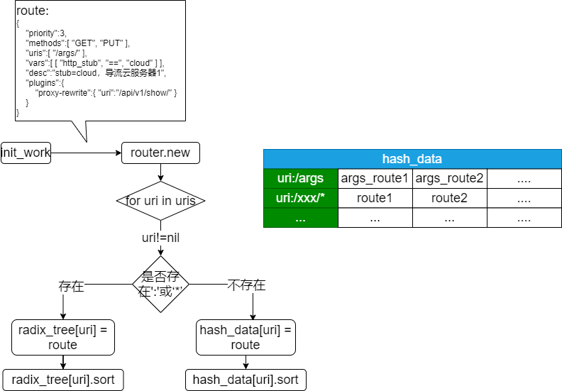
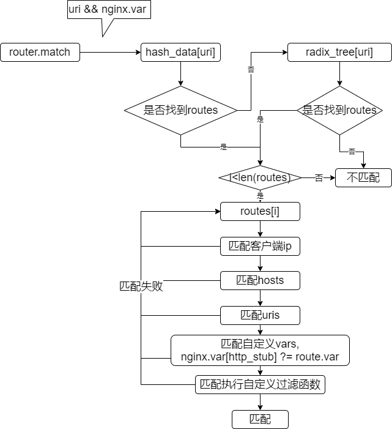

针对性的了解apisix插件化api网关，期望能给项目提供一些参考和优化(•̀⌄•́)
　　　　　　　　　　　　　　　　　　　　　　　　　　　　　　——　by JiHan
* * *
*[官方Git](https://github.com/apache/apisix)*
*[管理端页面](https://github.com/apache/apisix-dashboard)*
*[router-radixtree](https://github.com/apache/apisix/blob/master/doc/router-radixtree.md)*
*[结构设计](https://github.com/apache/apisix/blob/master/doc/zh-cn/architecture-design.md)*
*[安装参考](http://www.itheima.com/news/20200404/193127.html)*
*[APISIX高性能实践](https://segmentfault.com/a/1190000020128654)*
*[APISIX高性能实践续](https://zhuanlan.zhihu.com/p/89610466)*
*[APISIX上手](https://cloud.tencent.com/developer/article/1528618)*
*[官方参考dashboard](https://apisix.iresty.com/apisix/dashboard/#/schema/routes/list)*
*目前只在Coentos 7上安装测试，Centos 6上需要升级gcc，要支持`GLIBC_2.14`*

<!-- more -->

## 简介和安装
### apisix安装
直接看这个就可以了[**官方中文**](https://github.com/apache/apisix/blob/master/README_CN.md)
可能遇到问题：
1. openresty libssl.so.1.1 not found
   [升级openssl](https://www.cnblogs.com/emanlee/p/6100019.html)
2. 需要注意的是，etcd的协议版本问题，需要支持2版本? `export ETCDCTL_API=2`
### APISIX Dashboard安装
1. 安装前置环境：mysql，golang，nodejs(version >=10.xx)
2. 安装启用apisix
3. 配置mysql
   ```shell
   #输入你的密码和用户名
   $ mysql –uroot –p123456
    > source ./api/script/db/schema.sql
   ```
4. 编译运行后端程序
   ```shell
   cd api && go build -o ../manager-api . && cd ..
   sh ./api/run/run.sh &
   ```
5. 编译前端
   ```shell
   npm insert -g yarn
   yarn install
   yarn build
   ```
6. 联合apisix使用
   1. 将刚刚前端编译得到的`/dist`的内容，放到apisix下的dashboard文件夹
   2. 修改apisix脚本，添加如下服务：
        ```shell
        # vi ./bin/apisix
        server {
            listen 10080;
            # gzip config
            gzip on; 
            gzip_min_length 1k; 
            gzip_comp_level 9;
            gzip_types text/plain text/css text/javascript application/json application/javascript application/x-javascript application/xml;
            gzip_vary on; 
            gzip_disable "MSIE [1-6]\.";

            root /usr/share/nginx/html;
            include /usr/local/openresty/nginx/conf/mime.types;

            location / { 
                alias dashboard/;

                try_files $uri $uri/index.html /index.html =404;
            }   

            location /apisix/admin {
                proxy_pass http://127.0.0.1:8080/apisix/admin;
            }   
        }
        ```
    3. 重启apisix`./bin/apisix restart`
7. 访问`http://192.168.81.128:10080/`ip根据自己而定。默认登录名`admin`密码`admin`，可以在dashboard的`conf.json`中自己修改。


## APISIX的route匹配
项目需要，了解下apisix的route匹配方式。
首先apisix的架构参考[结构设计](https://github.com/apache/apisix/blob/master/doc/zh-cn/architecture-design.md)
apisix扩展匹配介绍[router-radixtree](https://github.com/apache/apisix/blob/master/doc/router-radixtree.md)

### 匹配原理和机制
其核心的实现机制是使用了`resty.radixtree`这个lua库，[详情](https://github.com/api7/lua-resty-radixtree)。包括路由匹配，域名匹配，方法匹配等。说白，都是字符匹配。
`route`匹配源码如下：
```lua
local require = require
local router = require("resty.radixtree")
local core = require("apisix.core")
local plugin = require("apisix.plugin")
local ipairs = ipairs
local type = type
local error = error
local loadstring = loadstring
local user_routes
local cached_version


local _M = {version = 0.2}


    local uri_routes = {}
    local uri_router
local function create_radixtree_router(routes)
    routes = routes or {}

    local api_routes = plugin.api_routes()
    core.table.clear(uri_routes)

    for _, route in ipairs(api_routes) do
        if type(route) == "table" then
            core.table.insert(uri_routes, {
                paths = route.uris or route.uri,
                methods = route.methods,
                handler = route.handler,
            })
        end
    end

    for _, route in ipairs(routes) do
        if type(route) == "table" then
            local filter_fun, err
            if route.value.filter_func then
                filter_fun, err = loadstring(
                                        "return " .. route.value.filter_func,
                                        "router#" .. route.value.id)
                if not filter_fun then
                    core.log.error("failed to load filter function: ", err,
                                   " route id: ", route.value.id)
                    goto CONTINUE
                end

                filter_fun = filter_fun()
            end

            core.log.info("insert uri route: ",
                          core.json.delay_encode(route.value))
            core.table.insert(uri_routes, {
                paths = route.value.uris or route.value.uri,
                methods = route.value.methods,
                priority = route.value.priority,
                hosts = route.value.hosts or route.value.host,
                remote_addrs = route.value.remote_addrs
                               or route.value.remote_addr,
                vars = route.value.vars,
                filter_fun = filter_fun,
                --主要处理函数，如果uri_router匹配上了，会调用这个headler
                handler = function (api_ctx)
                    api_ctx.matched_params = nil
                    api_ctx.matched_route = route
                end
            })

            ::CONTINUE::
        end
    end

    core.log.info("route items: ", core.json.delay_encode(uri_routes, true))
    uri_router = router.new(uri_routes)
end


    local match_opts = {}
function _M.match(api_ctx)
    if not cached_version or cached_version ~= user_routes.conf_version then
        -- 这里生成uri_router
        create_radixtree_router(user_routes.values)
        cached_version = user_routes.conf_version
    end

    if not uri_router then
        core.log.error("failed to fetch valid `uri` router: ")
        return true
    end

    core.table.clear(match_opts)
    match_opts.method = api_ctx.var.request_method
    match_opts.host = api_ctx.var.host
    match_opts.remote_addr = api_ctx.var.remote_addr
    match_opts.vars = api_ctx.var

    -- 这里是匹配核心
    local ok = uri_router:dispatch(api_ctx.var.uri, match_opts, api_ctx)
    if not ok then
        core.log.info("not find any matched route")
        return true
    end

    return true
end


function _M.routes()
    if not user_routes then
        return nil, nil
    end

    return user_routes.values, user_routes.conf_version
end


function _M.init_worker(filter)
    local err
    user_routes, err = core.config.new("/routes", {
            automatic = true,
            item_schema = core.schema.route,
            filter = filter,
        })
    if not user_routes then
        error("failed to create etcd instance for fetching /routes : " .. err)
    end
end


return _M
```
而在访问过程中对这个调用方式如下：
```lua
--调用上述的match函数
router.router_http.match(api_ctx)
--判断匹配是否成功
local route = api_ctx.matched_route
    if not route then
        return core.response.exit(404,
                    {error_msg = "failed to match any routes"})
    end
```

#### resty.radixtree匹配原理
主要分为两个部分，初始化注册`router`和运行时匹配过滤：
**初始化：**

1. 数据存储和查找的主key都是uri，全量匹配使用hash，通用匹配使用的都是radixtree。数据结构都可以参考图中的表。
2. 同一个uri有多个route的情况，会以数组的方式扩展，并且使用sort排序，排序顺序依据route中`priority`参数，越大优先级越高，越优先匹配。

**运行时Match：**

1. 调用`router:match(api_ctx.var.uri, match_opts, ...)`时，先使用`hash`来寻找相应的注册routes(routes在注册的时候，也是根据uri来进行hash表插入，如果hash表设置不能用，才使用radix_tree)。如果hash找不到，就使用`radix_tree`查找匹配(这部分是c代码，还没看)
2. 如果都匹配成功，`dispatch`会调用`route`里加入的`handler`。而`match`函数会返回`metadata`
3. 自定义函数方面，在定义route的时候，自定义`filter_fun`函数，进行匹配过滤的时候，就会调用`filter_fun`调用。类似示例如下：
    ```shell
    === TEST 1: sanity
    --- config
        location /t {
            content_by_lua_block {
                local radix = require("resty.radixtree")
                local rx = radix.new({
                    {
                        paths = "/aa",
                        metadata = "metadata /aa",
                        filter_fun = function(vars)
                            ngx.log(ngx.WARN, "start to filter")
                            return vars['arg_k'] == 'v'
                        end
                    }
                })
                ngx.say(rx:match("/aa", {vars = ngx.var}))
                ngx.say(rx:match("/aa", {}))
            }
        }
    --- request
    GET /t?k=v
    --- no_error_log
    [error]
    --- error_log
    start to filter
    --- response_body
    metadata /aa
    metadata /aa
    ```
4. 对于自定义变量的读取，比如有header，args和cookie里分别有个stub；nginx.var可以分别通过'http_'，'arg_'和'cookie_'直接读取相应的变量：
   nginx配置：
   ```shell
   access_by_lua_block {
        ngx.say("nnnnnnnnngxxxxxxx say:")
        ngx.say(ngx.var['http_stub'])
        ngx.say(ngx.var['arg_stub'])
        ngx.say(ngx.var['cookie_stub'])
        apisix.http_access_phase()
    }   
    $ curl -H 'stub:cloudxx' --cookie "stub=cccccookie" http://192.168.81.128:9080/args/?stub=arrrrg
    nnnnnnnnngxxxxxxx say:
    cloudxx
    arrrrg
    cccccookie
    {"error_msg":"failed to match any routes"}
   ```


### route匹配成功后server或upstream流程
首先，在route的配置中，`plugins`、`script`、`upstream/upstream_id`、`service_id`至少选择一个
当route匹配成功后会相应执行`plugins`...(目前猜测是根据优先级)
server最后关联的也是upstream，那么主要的还是介绍upstream的外发：
在route匹配成功后，会进行server_id和upstream_id的检查，如果有，就将相应的upstream结构赋值到`api_ctx.upstream_conf`，如果只有一个node，那么可以直接赋值相应的`upstream_host`，进行负载平衡，负载平衡特点：
1. 动态支持有权重的 round-robin 负载平衡
2. 动态支持一致性 hash 的负载均衡。
3. 启用上游节点的健康检查，将在负载均衡期间自动过滤不健康的节点，以确保系统稳定性。
4. 可以在 balancer 阶段使用自定义负载均衡算法。

## 性能
### route匹配性能
[lua-resty-radixtree](https://github.com/api7/lua-resty-radixtree)
We wrote some simple benchmark scripts. Machine environment: MacBook Pro (16-inch, 2019), CPU 2.3 GHz Intel Core i9.
```
$ make
cc -O2 -g -Wall -fpic -std=c99 -Wno-pointer-to-int-cast -Wno-int-to-pointer-cast -DBUILDING_SO -c src/rax.c -o src/rax.o
cc -O2 -g -Wall -fpic -std=c99 -Wno-pointer-to-int-cast -Wno-int-to-pointer-cast -DBUILDING_SO -c src/easy_rax.c -o src/easy_rax.o
cc -shared -fvisibility=hidden src/rax.o src/easy_rax.o -o librestyradixtree.so

$ make bench
resty -I=./lib -I=./deps/share/lua/5.1 benchmark/match-parameter.lua
matched res: 1
route count: 100000
match times: 10000000
time used  : 3.3849999904633 sec
QPS        : 2954209
each time  : 0.33849999904633 ns

resty -I=./lib -I=./deps/share/lua/5.1 benchmark/match-prefix.lua
matched res: 500
route count: 100000
match times: 1000000
time used  : 0.4229998588562 sec
QPS        : 2364066

resty -I=./lib -I=./deps/share/lua/5.1 benchmark/match-static.lua
matched res: 500
route count: 100000
match times: 10000000
time used  : 0.78799986839294 sec
QPS        : 12690357

resty -I=./lib -I=./deps/share/lua/5.1 benchmark/match-hosts.lua
matched res: 500
route count: 1000
match times: 100000
time used  : 1.6989998817444 sec
QPS        : 58858

resty -I=./lib -I=./deps/share/lua/5.1 benchmark/match-wildcard-hosts.lua
matched res: 500
route count: 1000
match times: 50000
time used  : 1.2469999790192 sec
QPS        : 40096
```