工作需要，了解了一下Net filter的工作原理。(•̀⌄•́)
　　　　　　　　　　　　　　　　　　　　　　　　　　　　　　——　by JiHan
* * *

*源码的版本：linux-3.10.0-1127.18.2.el7 (centos)*

<!-- more -->

# Netfilter介绍及其实现原理

[简介](https://www.ibm.com/developerworks/cn/linux/network/s-netip/index.html)

*包含netfilter的基本介绍，iptables规则介绍及使用，netfilter实现原理，自定义match实现，链接跟踪实现、ipset和iptables联动和ipset实现*

## 简介
**Netfilter**，在Linux内核中的一个软件框架，用于管理网络数据包。不仅具有网络地址转换（NAT）的功能，也具备数据包内容修改、以及数据包过滤等防火墙功能。利用运作于用户空间的应用软件，如`iptables`、`ebtables`和`arptables`等，来控制Netfilter，系统管理者可以管理通过Linux操作系统的各种网络数据包。
**iptables：**
Netfilter中最为常用的一种网络数据包过滤方式——IP包过滤，我们也将重点介绍这种过滤方式。用户在使用`iptables`时需要超级用户权限，以及内核模块需要`Xtables`模块做支撑。iptables只能处理ipv4，对应的ipv6则使ip6tables来处理。
**ebtables**
ebtables 是以太网桥防火墙，以太网桥工作在数据链路层，ebtables 主要用来过滤数据链路层数据包。使用 ebtables 可以实现 filtering 、NAT 和 brouting。过滤根据 MAC 头包括 VLAN ID 等信息确定是否丢弃该帧。MAC NAT 可以修改 MAC 源和目的地址。Brouting 意为 bridge or route，根据规则确定应该将数据帧路由给上层（iptables）还是通过网桥转给其它的接口。
ebtables 和我们熟悉的 iptables 很像，也有规则（rules）、链（chains）和表（tables）的概念。ebtables 使用规则确定应当对数据帧执行什么动作。规则按照不同的链分组，不同的表中包含不同的链。在 ebtables 中有三张表：filter、nat 和 broute，分别对应其三大功能模块。
需要注意的是如果一个以太网接口 eth1，它并没有桥接到网桥上，此时，从 eth1 进来的数据包不会走到 ebtables 中。在 bridge check 点，会检查数据包进入的接口是否属于某个桥，如果是则走 ebtables，否则直接走 iptables。也就是说，ebtables 只对桥接网络生效。
**arptables**
arptables 是运行在用户空间的应用软件，通过控制Linux内核netfilter模块，来管理地址解析协议(arp)数据包的过滤和转发。
arptables基于iptables开发，使用时也与iptables有些类似，都有“表（tables）”、“链（chain）”和“规则（rules）”三个层面。
但是arptables功能较单一，仅有filter一个表。并且，也只有INPUT（从内核2.4版）、OUTPUT（从内核2.4版）和FORWARD（从内核2.6版）三个内建链。arptables的主要用途之一是防范ARP欺骗。
### 基础结构
**Netfilter** 包含了一组内核钩子 API ，周边内核组件可以使用这些钩子在网络栈中注册回调函数。每一个在网络栈中流通的包到达相应的钩子时，就会触发相应的回调函数，从而能够完成包过滤、网络地址（端口）转换和网络包协议头修改等各种操作。
Netfilter 提供了五种钩子：

1. `NF_IP_PER_ROUNTING` — 当数据包到达计算机立即触发。
2. `NF_IP_LOCAL_IN` — 当数据包的目的地就是当前计算机时触发。
3. `NF_IP_FORWARD` — 当数据包目的地址是其它的网络接口时触发。
4. `NF_IP_POST_ROUTING` — 当数据包即将从计算机发出时触发。
5. `NF_IP_LOCAL_OUT` — 当数据包由本地生成并发向外部时触发。

基于 Netfilter 钩子 API 实现的内核模块主要有 ebtables、arptables、ip(6)tables、nf_tables、NAT、connection tracking 等。如下架构图：
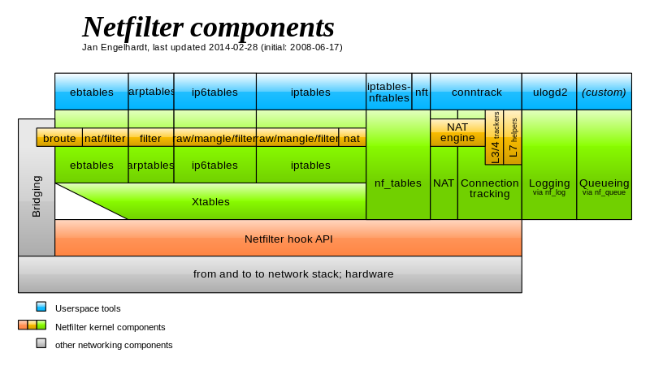

而数据包在整个Netfilter中的数据流如下图：
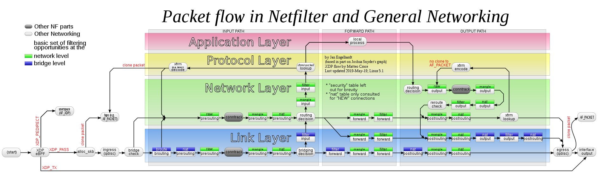


### 建立规则和链
通过向防火墙提供有关对来自某个源、到某个目的地或具有特定协议类型的信息包要做些什么的指令，规则控制信息包的过滤。 通过使用 netfilter/iptables 系统提供的特殊命令 iptables ，建立这些规则，并将其添加到内核空间的特定信息包过滤表内的链中。关于添加／除去／编辑规则的命令的一般语法如下：
```
iptables [-t table] command [match] [target]
```
#### 用法
|选项| 描述 | 
|---|---|
|-A --append|将一个或多个规则添加到所选链的末尾。|
|-C --check|检查与所选链中的规范匹配的规则。|
|-D --delete|从所选链中删除一个或多个规则。|
|-F --flush|逐个删除所有规则。|
|-I --insert|将一个或多个规则作为给定的规则编号插入所选链中。|
|-L --list|显示所选链中的规则。|
|-n --numeric|以数字格式显示IP地址或主机名和邮政编号。|
|-N --new-chain <name>|创建一个新的用户定义链。|
|-v --verbose|与list选项一起使用时提供更多信息。|
|-X --delete-chain <name>|删除用户定义的链。|

#### 示例
```
// 删除规则
iptables -F
iptables –flush
//设置链的默认策略
iptables -P INPUT DROP
//指定IP源和网卡丢弃
iptables -A INPUT -i eth0 -p tcp -s 192.168.100.1 -j DROP
//指定IP源和网卡tcp拒绝
iptables -A INPUT -i eth0 -p tcp -s 192.168.100.1 -j REJECT --reject-with tcp-reset
//仅允许来自于192.168.100.0/24域的用户的ssh连接请求
iptables -A INPUT -i eth0 -p tcp -s 192.168.100.0/24 --dport 22 -m state --state NEW,ESTABLISHED -j ACCEPT
//端口转发
iptables -t nat -A PREROUTING -p tcp -d 192.168.102.37 --dport 422 -j DNAT --to 192.168.102.37:22
//允许多端口访问
iptables -A INPUT -i eth0 -p tcp -m multiport --dports 22,80,443 -m state --state NEW,ESTABLISHED -j ACCEPT
//使用iptables nth将HTTPS流量负载平衡至两个不同的ip地址。
iptables -t nat -A PREROUTING -p tcp --dport 8000 -m state --state NEW -m statistic --mode nth --every 2 --packet 0 -j DNAT --to-destination 192.168.17.33:8001
iptables -t nat -A PREROUTING -p tcp --dport 8000 -m state --state NEW -m statistic --mode nth --every 2 --packet 1 -j DNAT --to-destination 192.168.17.33:8002
//防火墙服务器上的其中一个网卡连接到外部，另一个网卡连接到内部服务器，使用以下规则允许内部网络与外部网络的通信。此例中，eth1连接到外部网络(互联网)，eth0连接到内部网络(例如:192.168.1.x)。
iptables -A FORWARD -i eth0 -o eth1 -j ACCEPT
//按流量匹配ping次数。（--limit 10/minute表示一分钟产生10个令牌即6秒一个，--limit-burst 5表示令牌桶最多可以放5个令牌，此项默认值就是5。即实现了平均值(--limit)和峰值(--limit-burst)约束）
iptables -I INPUT 1 -p icmp -m limit --limit 10/minute --limit-burst 5 -j ACCEPT
//记录丢弃的数据表
iptables -N LOGGING
iptables -A INPUT -i eth0 -p tcp -s 10.92.2.188 -j LOGGING
iptables -A LOGGING -m limit --limit 2/min -j LOG --log-prefix "IPTables Packet Dropped: " --log-level 4
iptables -A LOGGING -j DROP
cat /var/log/messages | grep IPTables #(centos) 根据syslog的配置来确定位置。
```
## 规则构成
在我们执行一个iptables命令的时候，往往达到的效果，就是在某个表的某个链中添加某一条规则。而参与这条规则构成的包括表(table)、链（chain）、匹配(match)和目标（target）。下面将详细介绍这几个部分。
### 表(table)
iptables里包含了4张表，分别是filter、nat、mangle和raw表。而表的作用在于存放规则，比如我们平时执行`iptables -nL`会得到类似的结果：
```
Chain INPUT (policy ACCEPT)
target     prot opt source               destination         
ACCEPT     tcp  --  0.0.0.0/0            0.0.0.0/0           state NEW tcp dpt:80

Chain FORWARD (policy ACCEPT)
target     prot opt source               destination         

Chain OUTPUT (policy ACCEPT)
target     prot opt source               destination         
```
(policy XXX)表示着默认策略。表中包含的链，表示着表里的规则可生效的链范围。表和链有着如下关系：
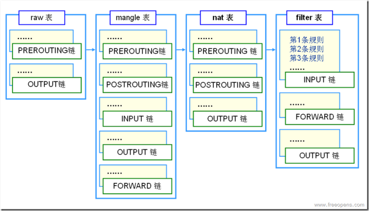
### 链(chain)
如果表是存放规则的地方，而链就是决定规则执行的时机，iptables中的5条链PREROUTING、INPUT、OUTPUT、FORWARD和POSTROUTING。而执行的位置也在简介中的netfilter hook原理中给出了。链把相应的表按照一定的顺序串起来，找出表里对应的规则进行执行。
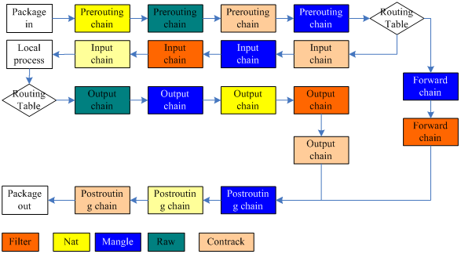
### 匹配(match)
`-m`或`--match`命令所做的工作，当然这部分我们称为扩展匹配，`-s -i`所执行的也是匹配工作，称为通用匹配。
**通用匹配**
类似`-s`这类的通用匹配，通常在用户态代码，和内核代码都包含了，不需要额外加载module。在iptables规则下发里，也是属于附加的基本参数。
**扩展匹配**
首先，我们在使用扩展匹配的时候，可以使用帮助文档：`iptables -m the_match_you_want --help`。扩展模块要工作的时候，都需要进行模块匹配，用户态匹配对应的libipt_xxx或libxt_xxx。内核态匹配对应的xt_xxx。比如我们使用的`-m state`在iptables命令执行时，会找`libxt_state.so`的动态库，规则下发到内核的时候，内核会找对应的`xt_state.ko`模块。具体源码实现后续会说明。
如果想自定义扩展匹配，那么需要写内核模块代码(参考内核模块源码的xt_multiport.c)和用户态模块代码(参考libxt_multiport.c)以及定义的头文件(参考xt_multiport.h)
### 目标(target)
`-j`所做的工作，在包匹配成功后，就会执行`-j`后面的动作，来对包进行处理。
#### 通用目标
`DROP`,`ACCEPT`,`QUEUE`和`RETURN`这几个属于通用匹配，他们同样以模块的形式进行加载和工作，对应的模块是`standard`
#### 扩展目标
扩展目标和扩展匹配也是相似的工作原理，都是进行模块加载。如果要写自定义模块，需要内核模块代码(参考xt_LOG.c)和用户态模块代码(参考libipt_LOG.c)和头文件(参考xt_LOG.h)

## Netfilter源码实现
Netfilter的整体工作方式类似下图：
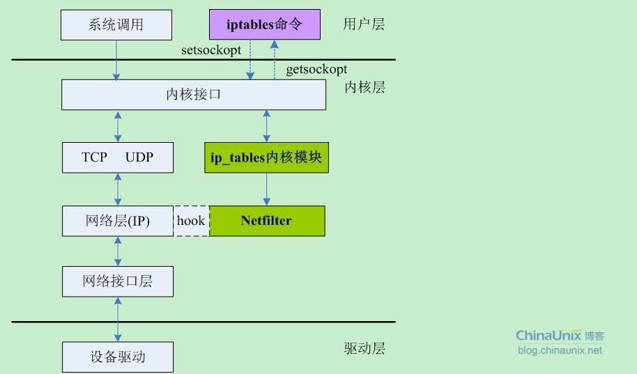
### 基本数据结构
由于本人也没有精读源码，所以也只能介绍个大概，一切以源码为准。
**xt_table与xt_table_info**
xt_table是Netfilter的核心数据结构，它包含了每个表的所有规则信息，以及匹配处理方法。数据包进入Netfilter后通过查表，匹配相应的规则来决定对数据包的处理结果。下面是xt_table的完整定义（在X_tables.h中）：
```c
struct xt_table {
    struct list_head list;

    /* What hooks you will enter on */
    unsigned int valid_hooks;

    /* Man behind the curtain... */
    struct xt_table_info *private;

    /* Set this to THIS_MODULE if you are a module, otherwise NULL */
    struct module *me;

    u_int8_t af;      /* address/protocol family */

    int priority;     /* hook order */

    /* A unique name... */

    const char name[XT_TABLE_MAXNAMELEN];
};
```
每个成员意思见上文定义中的注释，个别成员说明如下：
valid_hooks：所支持的hook点类型，决定后续注册hook操作的位置。比如filter表的valid_hoos被指定为：(1 << NF_INET_LOCAL_IN) | (1 << NF_INET_FORWARD) | (1 << NF_INET_LOCAL_OUT))，即在NF_INET_LOCAL_IN、NF_INET_FORWARD、NF_INET_LOCAL_OUT三处注册hook操作；
private：xt_table的数据区，包含了所有规则和规则处理方法等信息。xt_table_info详细信息见下文。

xt_table的所有数据都存在private的成员变量中，private是结构体struct xt_table_info，其定义如下：
```c
struct xt_table_info {
    /* Size per table */
    unsigned int size;

    /* Number of entries: FIXME. --RR */
    unsigned int number;

    /* Initial number of entries. Needed for module usage count */
    unsigned int initial_entries;

    /* Entry points and underflows */
    unsigned int hook_entry[NF_INET_NUMHOOKS];
    unsigned int underflow[NF_INET_NUMHOOKS];

    /*
     * Number of user chains. Since tables cannot have loops, at most
     * @stacksize jumps (number of user chains) can possibly be made.
     */
    unsigned int stacksize;
    unsigned int __percpu *stackptr;
    void ***jumpstack;

    /* ipt_entry tables: one per CPU */
    /* Note : this field MUST be the last one, see XT_TABLE_INFO_SZ */

    void *entries[1];
};
```
重要成员说明：
hook_entry: 不同hook点的规则的偏移量；
entries： 规则存储的入口，为可变区域，必须放在结构末尾。entries本质上是ipt_entry结构。关于ipt_entry定义和成员介绍见下文。

**ipt_entry**
ipt_entry结构是对规则的描述，其定义如下：
```c
/* This structure defines each of the firewall rules.  Consists of 3
   parts which are 1) general IP header stuff 2) match specific
   stuff 3) the target to perform if the rule matches */
struct ipt_entry {

    struct ipt_ip ip;

    /* Mark with fields that we care about. */
    unsigned int nfcache;

    /* Size of ipt_entry + matches */
    u_int16_t target_offset;

    /* Size of ipt_entry + matches + target */
    u_int16_t next_offset;

    /* Back pointer */
    unsigned int comefrom;

    /* Packet and byte counters. */
    struct xt_counters counters;

    /* The matches (if any), then the target. */
    unsigned char elems[0];
};
```
成员elems中，保存了一条规则的所有匹配（matchs），以及匹配后的处理操作（target）。在Iptables.c中，generate_entry（）方法新建一个ipt_entry，可以看到如何将matchs和target添加到ipt_entry中的：
```c
static struct ipt_entry *
generate_entry(const struct ipt_entry *fw,
           struct xtables_rule_match *matches,
           struct ipt_entry_target *target)
{
    unsigned int size;
    struct xtables_rule_match *matchp;
    struct ipt_entry *e;

    size = sizeof(struct ipt_entry);

    for (matchp = matches; matchp; matchp = matchp->next)
       size += matchp->match->m->u.match_size;

    e = xtables_malloc(size + target->u.target_size);
    *e = *fw;
    e->target_offset = size;
    e->next_offset = size + target->u.target_size;

    size = 0;
    for (matchp = matches; matchp; matchp = matchp->next) {
       memcpy(e->elems + size, matchp->match->m, matchp->match->m->u.match_size);
       size += matchp->match->m->u.match_size;
    }
    memcpy(e->elems + size, target, target->u.target_size);
    return e;
}
```
见上文的程序片段，ipt_entry的空间占用为：ipt_entry结构自身的size，加之所有match的size总和，加之target的size。填写elems时，首先将所有的match依次拷贝到elems指向的存储位置，紧接着将target拷贝到其后。下图是ipt_entry存储示意图：
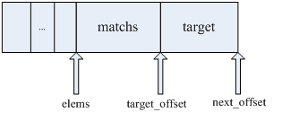


**nf_hook_ops**
nf_hook_ops用于注册一个hook操作，它主要包含了hook操作执行函数、hook类型，以及优先级。我们可以认为，一个nf_hook_ops表征了一个表的一条链，因为它与一个表的一个hook类型唯一对应。其完整定义如下：
```c
struct nf_hook_ops {
    struct list_head list;

    /* User fills in from here down. */
    nf_hookfn *hook;

    struct module *owner;

    u_int8_t pf;

    unsigned int hooknum;

    /* Hooks are ordered in ascending priority. */
    int priority;
};
```
重要成员说明：
hook：hook操作函数；
owner：所属的表；
hooknum：hook类型；
priority：优先级，决定同一hook点，链（不同表在同一个hook点的链）的执行次序。

**ipt_replace** 
结构主要用于iptables的规则下发，在setsockopt进行规则下发时以此结构体作为传输数据。
```c
/* The argument to IPT_SO_SET_REPLACE. */
struct ipt_replace {
	/* Which table. */
	char name[XT_TABLE_MAXNAMELEN];

	/* Which hook entry points are valid: bitmask.  You can't
           change this. */
	unsigned int valid_hooks;

	/* Number of entries */
	unsigned int num_entries;

	/* Total size of new entries */
	unsigned int size;

	/* Hook entry points. */
	unsigned int hook_entry[NF_INET_NUMHOOKS];

	/* Underflow points. */
	unsigned int underflow[NF_INET_NUMHOOKS];

	/* Information about old entries: */
	/* Number of counters (must be equal to current number of entries). */
	unsigned int num_counters;
	/* The old entries' counters. */
	struct xt_counters *counters;
  
	/* The entries (hang off end: not really an array). */
	struct ipt_entry entries[0];
};
```
重要成员说明：
entries：对应的扩展matches和target的数据集合，其组成方式就是上面对应ip_entry的介绍。

### Netfilter内部数据包处理
在简介中已经提到了netfilter的hook机制和hook点，现在我们来了解下具体流程。
首先，内核在收到ip包后，会进行一系列的操作，而hook的位置如下：
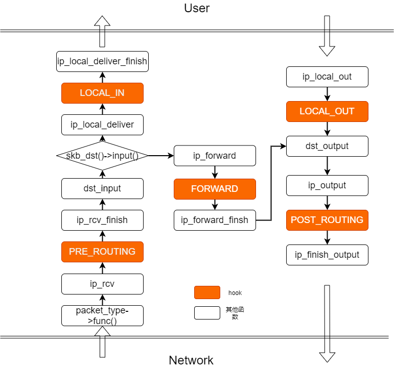
当我们对应的hook点有相应的注册函数时，就会进行相应的注册的hook函数调用：
```c
/*
 * 	Deliver IP Packets to the higher protocol layers.
 */
int ip_local_deliver(struct sk_buff *skb)
{
	/*
	 *	Reassemble IP fragments.
	 */

	if (ip_is_fragment(ip_hdr(skb))) {
		if (ip_defrag(skb, IP_DEFRAG_LOCAL_DELIVER))
			return 0;
	}

	return NF_HOOK(NFPROTO_IPV4, NF_INET_LOCAL_IN, NULL, skb,
		       skb->dev, NULL,
		       ip_local_deliver_finish);
}
```
*ip_input.c*
而实际的hook处理流程如下：
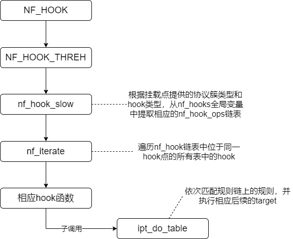
这里主要的实现函数`nf_hook_slow`
```c
int nf_hook_slow(struct sk_buff *skb, struct nf_hook_state *state)
{
	struct nf_hook_ops *elem;
	unsigned int verdict;
	int ret = 0;

	/* We may already have this, but read-locks nest anyway */
	rcu_read_lock();

	elem = list_entry_rcu(&nf_hooks[state->pf][state->hook],
			      struct nf_hook_ops, list);
next_hook:
	verdict = nf_iterate(&nf_hooks[state->pf][state->hook], skb, state,
			     &elem);
	if (verdict == NF_ACCEPT || verdict == NF_STOP) {
		ret = 1;
	} else if ((verdict & NF_VERDICT_MASK) == NF_DROP) {
		kfree_skb(skb);
		ret = NF_DROP_GETERR(verdict);
		if (ret == 0)
			ret = -EPERM;
	} else if ((verdict & NF_VERDICT_MASK) == NF_QUEUE) {
		int err = nf_queue(skb, elem, state,
				   verdict >> NF_VERDICT_QBITS);
		if (err < 0) {
			if (err == -ECANCELED)
				goto next_hook;
			if (err == -ESRCH &&
			   (verdict & NF_VERDICT_FLAG_QUEUE_BYPASS))
				goto next_hook;
			kfree_skb(skb);
		}
	}
	rcu_read_unlock();
	return ret;
}
```
这里的`nf_hooks[state->pf][state->hook]`中，`state->pf`是对应的协议，比如`NFPROTO_IPV4`, `state->hook`表示hook的点，比如`NF_INET_LOCAL_IN`。而nf_hooks是一个全局变量，包含了所有的注册hook。
在进入到`ipt_do_table`函数后，会进行包的匹配和处理，流程如下：
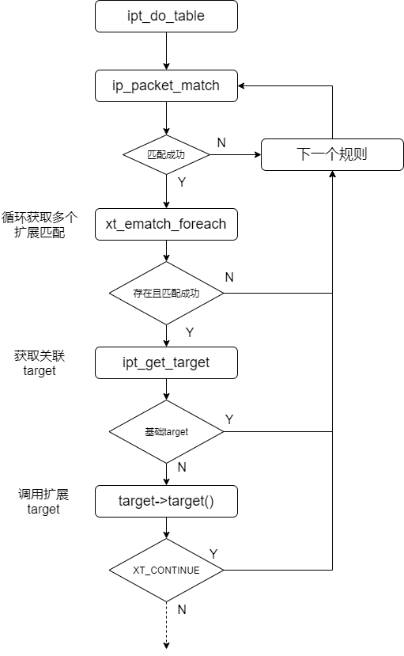
`ipt_do_table`会先匹配基本match，再匹配扩展match，匹配成功后，进行基础target或扩展target的处理。如果匹配不成功，则会一直匹配直到所有matches匹配完。这也导致了iptables规则在命中一条规则后，后续的规则都不会再进行匹配了(除非你target指向其他链)。
内部数据包处理大概如上所说，但是我们仍然抱有疑惑，hook函数哪里来？扩展match怎么生效等。这就要归功于netfilter的注册机制。
### Netfilter模块注册
模块注册的时机是在模块加载的时候，而模块加载分系统启动时加载，即系统启动时加载netfilter以及编译到内核的模块。
而没有编译到内核，而是以独立模块存在的netfilter模块，则会在规则下发的时候，会根据你传入的match或target名称到对应的路径下寻找，并载入模块。
netfilter在设计的时候，就设计了强大的模块加载机制，因此也表现出强大的扩展性。
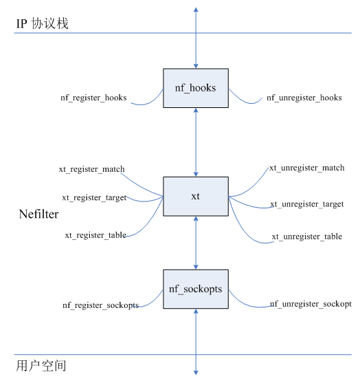
本质上，模块加载结构都是相似的。我们就以`iptable_filter.c`为例，讲解一下hook的注册过程。
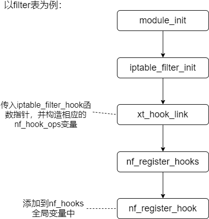
对应的部分`iptable_filter.c`代码：
```c
static const struct xt_table packet_filter = {
	.name		= "filter",
	.valid_hooks	= FILTER_VALID_HOOKS,
	.me		= THIS_MODULE,
	.af		= NFPROTO_IPV4,
	.priority	= NF_IP_PRI_FILTER,
};

static unsigned int
iptable_filter_hook(const struct nf_hook_ops *ops, struct sk_buff *skb,
		    const struct net_device *in, const struct net_device *out,
		    const struct nf_hook_state *state)
{
	const struct net *net;

	if (ops->hooknum == NF_INET_LOCAL_OUT &&
	    (skb->len < sizeof(struct iphdr) ||
	     ip_hdrlen(skb) < sizeof(struct iphdr)))
		/* root is playing with raw sockets. */
		return NF_ACCEPT;

	net = dev_net(state->in ? state->in : state->out);
	return ipt_do_table(skb, ops->hooknum, state, net->ipv4.iptable_filter);
}

....

static int __init iptable_filter_init(void)
{
	int ret;

	ret = register_pernet_subsys(&iptable_filter_net_ops);
	if (ret < 0)
		return ret;

	/* Register hooks */
	filter_ops = xt_hook_link(&packet_filter, iptable_filter_hook);
	if (IS_ERR(filter_ops)) {
		ret = PTR_ERR(filter_ops);
		unregister_pernet_subsys(&iptable_filter_net_ops);
	}

	return ret;
}

static void __exit iptable_filter_fini(void)
{
	xt_hook_unlink(&packet_filter, filter_ops);
	unregister_pernet_subsys(&iptable_filter_net_ops);
}

module_init(iptable_filter_init);
module_exit(iptable_filter_fini);
```
netfilter注册的逻辑依赖内核模块注册。内核模块加载的时候，会自动调用module_init，在iptable_filter中，调用`iptable_filter_init`，执行`xt_hook_link`函数，将`packet_filter`全局量挂载到`nf_hooks`全局量。实际包过滤的时候，就会根据`nf_hooks`来调用注册的hook。
以上就是hook的注册过程，实际在看源码中，match和target等注册过程也是类似的，通过module_init将模块文件的变量注册到全局量中。
### iptables规则下发
内核空间与用户空间的数据交互通过getsockopt和setsockopt来完成，这个两个函数用来控制相关socket文件描述符的的选项值。先来看这两个函数的原型：
set/getsockopt(2)函数的基本使用格式为：
```
int setsockopt(int sockfd, int proto, int cmd, void *data, int datalen)
int getsockopt(int sockfd, int proto, int cmd, void *data, int datalen)
```
在调用`setsockopt`函数时，实际执行的流程如下：
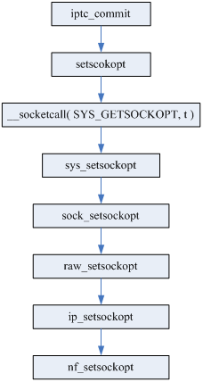
上图中，从setsockopt()到ip_setsockopt()是常规的setsockopt调用流程；在新的流程中，Netfilter加入的自己的处理函数nf_setsockopt()。
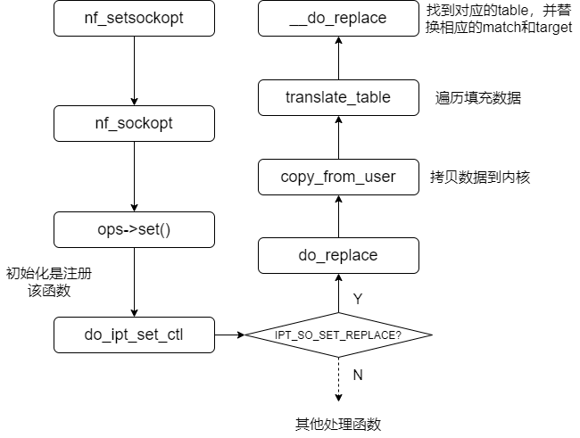
上图中，核心函数`do_replace`，进行的数据拷贝传输，源码如下：
```c
static int
do_replace(struct net *net, const void __user *user, unsigned int len)
{
	int ret;
	struct ipt_replace tmp;
	struct xt_table_info *newinfo;
	void *loc_cpu_entry;
	struct ipt_entry *iter;

	if (copy_from_user(&tmp, user, sizeof(tmp)) != 0)
		return -EFAULT;

	/* overflow check */
	if (tmp.num_counters >= INT_MAX / sizeof(struct xt_counters))
		return -ENOMEM;
	if (tmp.num_counters == 0)
		return -EINVAL;

	tmp.name[sizeof(tmp.name)-1] = 0;

	newinfo = xt_alloc_table_info(tmp.size);
	if (!newinfo)
		return -ENOMEM;

	loc_cpu_entry = newinfo->entries;
	if (copy_from_user(loc_cpu_entry, user + sizeof(tmp),
			   tmp.size) != 0) {
		ret = -EFAULT;
		goto free_newinfo;
	}

	ret = translate_table(net, newinfo, loc_cpu_entry, &tmp);
	if (ret != 0)
		goto free_newinfo;

	duprintf("Translated table\n");

	ret = __do_replace(net, tmp.name, tmp.valid_hooks, newinfo,
			   tmp.num_counters, tmp.counters);
	if (ret)
		goto free_newinfo_untrans;
	return 0;

 free_newinfo_untrans:
	xt_entry_foreach(iter, loc_cpu_entry, newinfo->size)
		cleanup_entry(iter, net);
 free_newinfo:
	xt_free_table_info(newinfo);
	return ret;
}
```
从源码可以看到，iptables和内核间的通信，就是通过调用`copy_from_user`函数进行数据拷贝来完成的。而拷贝的核心数据结构，就是上面介绍过的`ipt_replace`结构。
至此，Netfilter源码实现的主要流程就介绍完了，更多的细节可自行阅读源码。
## 自定义match
主要是为了练习，功能就是命中后打印输出一下。
要实现一个iptables的自定义功能，那么，我应该产生三个文件libipt_xx.c、ipt_xx.c和ipt_xx.h(ipt更换为xt一样有效)，并放到对应目录中：
```
ipt_xx.c   -> /<linux-kernel-src>/net/ipv4/netfilter/
ipt_xx.h   -> /<linux-kernel-src>/include/uapi/linux/netfilter_ipv4
libipt_xx.c   -> /usr/local/src/iptables-x.x.x/extensions/
```
然后再分别编译内核部分ipt_xx.c和ipt_xx.h源码及用户部分libipt_xx.c源码。
### 环境准备
**内核源码下载**
通用的linux内核源码的[下载](https://www.kernel.org/)
centos/redhat的内核在上面找不到对应的，他们是自己维护的版本，下载方法如下：
```
# 先复制及设定 centos-common 源码
[user@host ~]$ git clone  https://git.centos.org/centos-git-common.git
[user@host ~]$ git clone https://git.centos.org/rpms/kernel.git ; cd kernel
# 让我们存取 cenots7 内核
[user@host kernel]$ git checkout c7 
# get_sources会根据你的电脑内核版本，匹配对应的源码。
[user@host kernel]$ ~/centos-git-common/get_sources.sh
```
如果你对特定分支感兴趣，也可以下载特定分支：
```
git clone -b c7 --single-branch https://git.centos.org/rpms/kernel.git
```
这里的内核源码也包含了Netfilter的内核源码。

**iptables源码：**
*本文使用的是iptables v1.14.21版本，对应的源码也是这个版本* [下载](https://www.netfilter.org/projects/iptables/downloads.html)

### 自定义match源码
内核部分：xt_test.c
```c
#define pr_fmt(fmt) KBUILD_MODNAME ": " fmt
#include <linux/module.h>
#include <linux/types.h>
#include <linux/udp.h>
#include <linux/skbuff.h>
#include <linux/in.h>
#include <linux/kernel.h>  

#include <linux/netfilter/xt_test.h>
#include <linux/netfilter/x_tables.h>
#include <linux/netfilter_ipv4/ip_tables.h>
#include <linux/netfilter_ipv6/ip6_tables.h>

MODULE_LICENSE("GPL");
MODULE_AUTHOR("Netfilter Core Team <coreteam@netfilter.org>");
MODULE_DESCRIPTION("Xtables: multiple port matching for TCP, UDP, UDP-Lite, SCTP and DCCP");
MODULE_ALIAS("ipt_test");
MODULE_ALIAS("ip6t_test");

static bool
test_mt(const struct sk_buff *skb, struct xt_action_param *par)
{
	const struct xt_test *testinfo = par->matchinfo;
	const struct iphdr *ip;
	ip = ip_hdr(skb);
	if (testinfo->s_addr == ip->saddr){
		printk("match ip [%s]",ip->saddr);
		return true;
	}
	return false;
}

static inline bool
check(u_int16_t proto)
{
	return proto == IPPROTO_TCP;
}

char *
inet_ntoa(struct in_addr ina)
{
	static char buf[sizeof "aaa.bbb.ccc.ddd"];
	unsigned char *ucp = (unsigned char *)&ina;

	sprintf(buf, "%d.%d.%d.%d",
		ucp[0] & 0xff,
		ucp[1] & 0xff,
		ucp[2] & 0xff,
		ucp[3] & 0xff);
    return buf;
}

static int test_mt_check(const struct xt_mtchk_param *par)
{
	const struct ipt_ip *ip = par->entryinfo;
	printk("input ip:%s", inet_ntoa(ip->src));
	return 0;
}

static struct xt_match test_mt_reg __read_mostly = {
	.name		= "test",
	.family		= NFPROTO_IPV4,
	.revision	= 1,
	.checkentry	= test_mt_check,
	.match		= test_mt,
	.matchsize	= sizeof(struct xt_test),
	.me		= THIS_MODULE,
};

static int __init test_mt_init(void)
{
	printk("test module init sucess");
	return xt_register_match(&test_mt_reg);
}

static void __exit test_mt_exit(void)
{
	xt_unregister_match(&test_mt_reg);
}

module_init(test_mt_init);
module_exit(test_mt_exit);
```
用户部分：libxt_test.c
```c
#include <stdio.h>
#include <netdb.h>
#include <string.h>
#include <stdlib.h>
#include <xtables.h>
#include <limits.h> /* INT_MAX in ip_tables.h/ip6_tables.h */
#include <linux/netfilter_ipv4/ip_tables.h>
#include <linux/netfilter_ipv6/ip6_tables.h>
#include <linux/netfilter/xt_test.h>
#include <sys/socket.h>

enum {
	O_SOURCE_PORTS = 0,
	O_DEST_PORTS,
	O_SD_PORTS,
	F_SOURCE_PORTS = 1 << O_SOURCE_PORTS,
	F_DEST_PORTS   = 1 << O_DEST_PORTS,
	F_SD_PORTS     = 1 << O_SD_PORTS,
	F_ANY          = F_SOURCE_PORTS | F_DEST_PORTS | F_SD_PORTS,
};

/* Function which prints out usage message. */
static void test_help(void)
{
	printf(
"test match options:\n"
" --source-ip [ip]\n"
" NOTE: just for test.\n");
}

static const struct xt_option_entry test_opts[] = {
	{.name = "source-ip", .id = O_SOURCE_PORTS, .type = XTTYPE_STRING,
	 .excl = F_ANY, .flags = XTOPT_INVERT},
	XTOPT_TABLEEND,
};

static const char *
proto_to_name(uint8_t proto)
{
	switch (proto) {
	case IPPROTO_TCP:
		return "tcp";
	default:
		return NULL;
	}
}

static unsigned int
parse_srource_ip(const char *portstring)
{
	char *buffer;
	struct in_addr addr;

	buffer = strdup(portstring);
	if (!buffer) xtables_error(OTHER_PROBLEM, "strdup failed");

	if(!inet_aton(buffer, &addr)) xtables_error(OTHER_PROBLEM, "ip not vaild");
	free(buffer);
	return (unsigned int)addr.s_addr;
}

static const char *
check_proto(uint16_t pnum, uint8_t invflags)
{
	const char *proto;

	if (invflags & XT_INV_PROTO)
		xtables_error(PARAMETER_PROBLEM,
			   "test only works with TCP, UDP, UDPLITE, SCTP and DCCP");

	if ((proto = proto_to_name(pnum)) != NULL)
		return proto;
	else if (!pnum)
		xtables_error(PARAMETER_PROBLEM,
			   "test needs `-p tcp', `-p udp', `-p udplite', "
			   "`-p sctp' or `-p dccp'");
	else
		xtables_error(PARAMETER_PROBLEM,
			   "test only works with TCP, UDP, UDPLITE, SCTP and DCCP");
}

static void __test_parse(struct xt_option_call *cb, uint16_t pnum,
			      uint8_t invflags)
{
	const char *proto;
	struct xt_test *multiinfo = cb->data;

	xtables_option_parse(cb);
	switch (cb->entry->id) {
	case O_SOURCE_PORTS:
		//proto = check_proto(pnum, invflags);
		multiinfo->s_addr = (__be32)parse_srource_ip(cb->arg);
		break;
	}
	if (cb->invert)
		xtables_error(PARAMETER_PROBLEM,
			   "test.0 does not support invert");
}

static void test_parse(struct xt_option_call *cb)
{
	const struct ipt_entry *entry = cb->xt_entry;
	return __test_parse(cb,
	       entry->ip.proto, entry->ip.invflags);
}

static void test_check(struct xt_fcheck_call *cb)
{
	if (cb->xflags == 0)
		xtables_error(PARAMETER_PROBLEM, "test expection an option");
}

static void
__test_print(const struct xt_entry_match *match, int numeric,
                  uint16_t proto)
{
	const struct xt_test *multiinfo
		= (const struct xt_test *)match->data;
	struct in_addr addr;
	addr.s_addr = (in_addr_t)multiinfo->s_addr;

	printf(" test ");

	printf("%s",inet_ntoa(addr));
}

static void test_print(const void *ip_void,
                            const struct xt_entry_match *match, int numeric)
{
	const struct ipt_ip *ip = ip_void;
	__test_print(match, numeric, ip->proto);
}

static void __test_save(const struct xt_entry_match *match,
                             uint16_t proto)
{
	const struct xt_test *multiinfo
		= (const struct xt_test *)match->data;
	struct in_addr addr;
	addr.s_addr = (in_addr_t)multiinfo->s_addr;

	printf(" test ");

	printf("%s",inet_ntoa(addr));
}

static void test_save(const void *ip_void,
                           const struct xt_entry_match *match)
{
	const struct ipt_ip *ip = ip_void;
	__test_save(match, ip->proto);
}

static struct xtables_match test_mt_reg = {
	.family        = NFPROTO_IPV4,
	.name          = "test",
	.revision      = 1,
	.version       = XTABLES_VERSION,
	.size          = XT_ALIGN(sizeof(struct xt_test)),
	.userspacesize = XT_ALIGN(sizeof(struct xt_test)),
	.help          = test_help,
	.x6_parse      = test_parse,
	.x6_fcheck     = test_check,
	.print         = test_print,
	.save          = test_save,
	.x6_options    = test_opts,
};

void
_init(void)
{
	xtables_register_match(&test_mt_reg);
}
```
头文件：xt_test.h
```c
/* SPDX-License-Identifier: GPL-2.0 WITH Linux-syscall-note */
#ifndef _XT_TEST_H
#define _XT_TEST_H

#include <linux/types.h>

/* Must fit inside union xt_matchinfo: 16 bytes */
struct xt_test {
	__be32	s_addr;				/* Type of comparison */
};

#endif /*_XT_MULTIPORT_H*/
```
### 编译
首先把对应的文件放到对应的位置：
```
xt_test.c   -> /<linux-kernel-src>/net/ipv4/netfilter/
xt_test.h   -> /<linux-kernel-src>/include/uapi/linux/netfilter_ipv4
libxt_test.c   -> /<iptables-x.x.x>/extensions/
```
用户态源码编译：
```shell
./autogen.sh
./configure --prefix=/usr/local/iptables
make
make install
```
内核源码编译：
```
cd <your_kernel_src_path>/net/netfilter
#修改Makefile，新增：obj-$(CONFIG_NETFILTER_XT_MATCH_TEST) += xt_test.o
make CONFIG_NETFILTER_XT_MATCH_TEST=m -C <your_kernel_src_path>  M=`pwd` modules
```
如果出现`No rule to make target 'tools/objtool/objtool'`的错误：
1. `yum install kernel-headers kernel-devel -y`
2. 找到`/usr/src/kernels/`下安装的tools/objtool/objtool/objtool，将可执行文件拷贝到你的内核源码对应目录。
3. 重新执行make

### 测试
1. 先把编译得到的`xt_test.ko`放到`/usr/lib/modules/3.10.0.xxxx/kernel/net/netfilter/`目录下。
2. 添加iptables规则：
   ```
   /usr/local/iptables/sbin/iptables -A INPUT -p tcp -m test --source-ip <ip> -j DROP
   ```
3. 使用你配置了的`<ip>`地址的机器来访问目标机器(tcp)
4. `dmesg`命令来查看打印输出的消息。

如果出现`Couldn't load match 'test11':No such file or directory`证明你用户态代码，没有找到你编译的模块。
如果出现`iptables:No chain/target/match by the name`证明你内核相应的模块没有嵌入。
如果`dmesg`没有显示出你想要的信息，可能是输出日志级别不够，尝试：`dmesg -n 7`；或者是存在缓存，尝试删除原有iptables规则，重新配置，之前的日志消息就打印了。


## 链接跟踪(conntrack)
功能就是给链接做标识。这一章节主要都是参考(也就是抄[狗头])Netfilter[链接跟踪简介](http://blog.chinaunix.net/uid-26517122-id-4281274.html)(想看更详细内容最好看原文，我这里只是简单截取了主要核心部分，就不重复copy了)，他其他的netfilter相关的解析也写的挺好，建议去看看。
#### conntrack介绍
 我们期望一种场景，即外网无法访问内网，但是内网能够访问外网。但配置了拒绝所有外网来的数据包以后，内网访问外网返回的包也无法进入内网，导致内网访问外网失败。因此我们可以利用conntrack(链接跟踪)来解决这一问题。
通用的数据访问方式分两种：
1. TCP这种面向连接的协议，源和目的的连接终止时，状态防火墙通过检查TCP头的控制标记来跟踪整个过程，并动态地将该连接从状态表中删除。
2. DP和ICMP不是面向连接的协议，无法通过报文来判断连接是否终止。状态防火墙会把将UDP流量看成是有连接的，通过在状态表中设置一个定时器，来定期的老化删除一些无用连接。

期望连接：
有一些协议，连接时会分为控制连接和数据连接，我们把数据连接称为是控制连接的期望连接。
我们以tftp协议为例来说明一下期望连接：
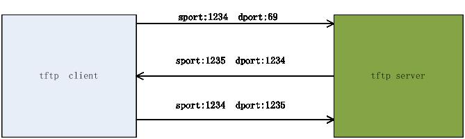
如果，客户端先发起连接，使用熟知的69端口。因为69端口是分给了tftp server的，tftp server接收到连接请求后，会自己申请一个server主机上未用的端口1235（因为tftp server的69端口还需要接收其他client发来的连接请求，所有不能使用69来传输数据），给tftp client发送回应。以后client和server就使用端口1235来进行通信了。
现在来看，上面连接是两条不同的连接。我们把第二条连接是其一条连接的期望连接。
比如防火墙上只放开了目的端口号69的访问，当内网访问外网的tftp server时，回应报文就会被拦截，导致tftp 功能失效。状态防火墙提出期望连接，当回应报文根据目的端口号发现该回应是已存在连接的期望连接，防火墙放过该回应报文，这样tftp功能OK。
做个实验：
在一台主机上配置如下规则：
```
iptables  -P  INPUT DROP   //丢弃所有到本机的报文
iptables -A INPUT -p udp --dport 69 -j ACCEPT //放行目的端口69的报文
```
这时把该主机当tftp client，从tftp server下载东西是无法下载的。
```
iptables -A INPUT -m conntrack --ctstatus EXPECTED -j ACCEPT//放行期望连接
```
这时tftp功能OK。

因此，为了满足上述需求，链接跟踪实现了以下功能：
1. 建立一张连接状态表，来存放连接记录
2. 连接状态表中，有定时的垃圾回收机制
3. 根据报文进行连接状态的建立及对已有连接状态的更新
4. 期望连接的建立和关联
5. 在连接跟踪上需要提供易于扩展的接口，来实现用户自定义的一些功能。
下面本文将从两个方向来描述链接跟踪，一是从模块扩展上，模块如何注册到conntrack中，提供报文的处理方法；第二是数据流上，报文时如何一步步的在netfilter框架中流动，被conntrack处理的。

### conntrack标识
连接跟踪是根据报文的L3，L4层头信息来标识一条连接的，而这些标识需要一个数据结构来进行定义和存储。改数据结构包含了一条连接的全部信息，并且链接跟踪的查找，建立，关联和更新都是依据该数据结构，我们称该数据结构为元组。
**元组数据结构：**
```c
struct nf_conntrack_tuple
{
     struct nf_conntrack_man src;  //源端信息

   //目的端信息。
    /* These are the parts of the tuple which are fixed. */
    struct {
        union nf_inet_addr u3;  //目的IP地址
　　  //目的端口的信息，不同协议使用不同的报文字段
        union {
             /* Add other protocols here. */
            __be16 all;
            struct {
                __be16 port;//TCP报文就使用目的端口
            } tcp;
            struct {
                 __be16 port;//UDP报文就使用目的端口
            } udp;
            struct {
                u_int8_t type, code;//ICMPP报文使用type，cod两个字段
            } icmp;
            ... //其他协议此处省略
        } u;
        //传输层协议类型，既L4协议类型
        u_int8_t protonum;
        //标识连接的方向，一条连接分两个方向，一来一回
        /* The direction (for tuplehash) */
        u_int8_t dir;
    } dst;
};


struct nf_conntrack_man
{
     union nf_inet_addr u3; //IP地址
    //L4协议源端信息
    union nf_conntrack_man_proto u;
    //L3协议类型
    u_int16_t l3num;
};


//L4层源端的信息。
union nf_conntrack_man_proto
{
    /* Add other protocols here. */
    __be16 all;
    struct {
        __be16 port;
    } tcp;
    struct {
        __be16 port;
    } udp;
    struct {
        __be16 id;
    } icmp;
    .... //其他协议此处省略
};
```
从上面数据结构定义看，标识一条连接的元组为：
TCP  源IP，源端口，L3协议类型，目的IP，目的端口号，L4协议类型
UDP  源IP，源端口，L3协议类型，目的IP，目的端口号，L4协议类型
ICMP 源IP，L3协议类型，目的IP，id，type，code,，L4协议类型

**conntrack数据结构：**
一个连接包含正反两个方向的两条报文流.
```c
struct nf_conn {
    //对连接的引用计数
    struct nf_conntrack ct_general;
    spinlock_t lock;

    //正向和反向的连接元组信息。
    struct nf_conntrack_tuple_hash tuplehash[IP_CT_DIR_MAX];

    //该连接的连接状态
    unsigned long status;

    //如果该连接是期望连接，指向跟其关联的主连接
    struct nf_conn *master;

    //连接垃圾回收定时器
    struct timer_list timeout;

    /*存储特定协议的连接跟踪信息*/
    union nf_conntrack_proto proto;

    /*指向扩展结构，该结构中包含一些基于连接的功能扩展处理函数 */
    struct nf_ct_ext *ext;
   //网络命名空间
    struct net *ct_net;
};

struct nf_conntrack_tuple_hash {
    struct hlist_nulls_node hnnode;
    struct nf_conntrack_tuple tuple;
};
```
每个struct nf_conn实例代表一个连接。每个skb都有一个指针，指向和它相关联的连接。
```c
struct sk_buff {
	struct nf_conntrack *nfct;//指向struct nf_conn实例

	kmemcheck_bitfield_begin(flags1);
	__u8 local_df:1,
	cloned:1,
	ip_summed:2,
	nohdr:1,
	nfctinfo:3; //记录报文的连接状态。
	kmemcheck_bitfield_end(flags1);
};
```

**conntrack的存储:**
*/include/net/netns/conntrack.h*
每个网络命名空间有如下一个数据结构的实例，来管理和存放生成的连接的一些信息。
```c
struct netns_ct 
{
    atomic_t count;
    unsigned int expect_count;
    unsigned int htable_size; 
    struct kmem_cache *nf_conntrack_cachep;
    struct hlist_nulls_head *hash;//存放已经经过确认的连接hash表
    struct hlist_head *expect_hash;//期望连接hash表
    struct hlist_nulls_head unconfirmed; //存放没经过确认的连接hash表
    struct hlist_nulls_head dying;
    struct ip_conntrack_stat *stat;

    int hash_vmalloc;
    int expect_vmalloc;
    char *slabname;
};
```
整体conntrack相关的数据结构如下：
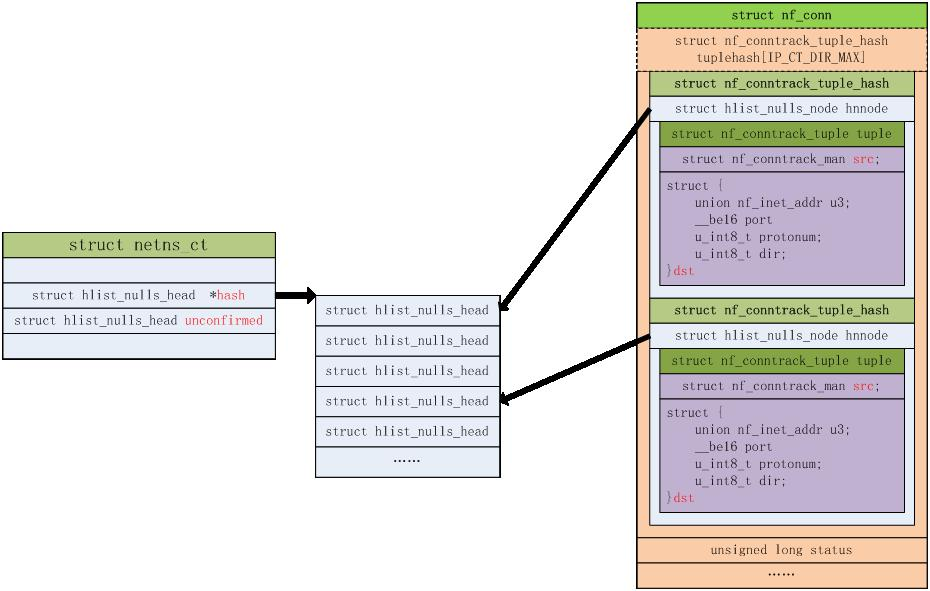

### conntrack的建立过程
我们先来看一下iptables定义的连接状态：
**INVALID** :无效连接，防火墙一般会丢弃该连接
**NEW**：新建立的，既只是通信双方中只一方发送了报文，还没有得到回应的
**ESTABLISHED**：已经得到回应的连接。既通信双方都发送过报文的连接
**RELATED**:关联的连接，既有期望连接关联的连接
**UNTRACKED**：不进行连接跟踪的连接
**SNAT**:配置了SNAT的连接
**DNAT**:配置了DNAT的连接

#### 一般连接建立过程：
这里我们拿一个udp通信的例子来走一遍连接建立的过程。先不具体到代码的实现。

1、首先，PC和SERVER使用udp报文进行通信。
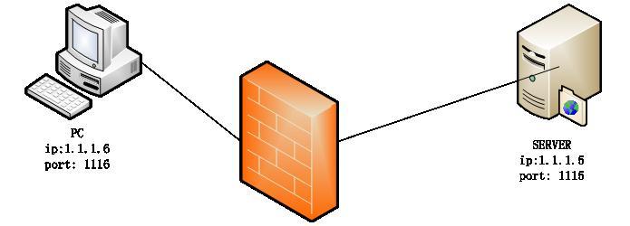
**PC--------->SERVER**

报文的元组信息如下：
```
Sip：1.1.1.6
Sport:1116
Dip:1.1.1.5
Dport:1115
l4protonum:udp
L3num:INET
```
报文到达防火墙，防火墙的处理如下：
**防火墙入口处:**
1. conntrack模块截获报文。
2. 根据报文的元组信息在防火墙内的连接表中查找是否已经存在建立的连接，因为第一次通信，没有已建立的连接。

建立一个新的连接，连接的正反向元组信息如下图，并把该连接的正向连接A挂到unconfirmed链表上
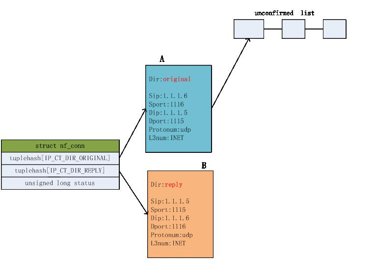
如上，新建连接后，把该连接和报文进行关联，连接状态是NEW。

**防火墙出口处：**
拦截报文后，根据报文携带的连接信息，找到连接，把该连接的正向连接A从unconfirmed链表上摘下来，把该连接的正反向连接A和B加入到连接hash表中。并把该连接确认状态置为confirmed状态，即置位status的IPS_CONFIRMED_BIT位。
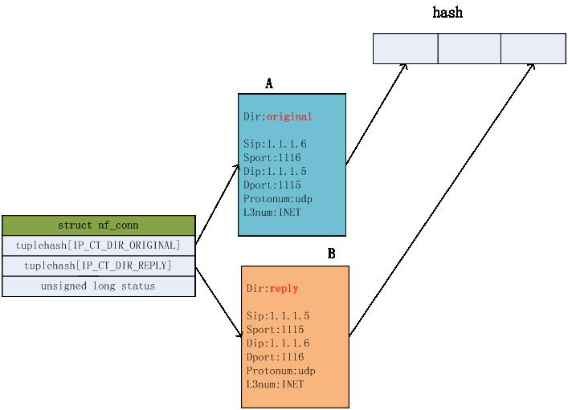

**SERVER----->PC**
SERVER回应PC的报文元组信息如下：
```
Sip：1.1.1.5
Sport:1115
Dip:1.1.1.6
Dport:1116
l4protonum:udp
L3num:INET
```

报文到达防火墙，防火墙的处理如下：
**防火墙入口处:**
1. conntrack模块截获报文。
2. 根据报文的元组信息在防火墙内的连接表中查找是否已经存在建立的连接，可以找到已建立的连接B。
3. 发现连接B里的dir是reply，表明该连接已经有回应报文了，给连接中的status置位IPS_SEEN_REPLY_BIT，表明该连接已经收到了回应报文。这时把报文的连接状态变为ESTABLISHED

**防火墙出口处：**
1. 拦截报文后，根据报文携带的连接信息，找到连接，发现该连接确认状态是confirmed的，直接不进行连接处理。

至此，连接建立完成。

后续该连接的正反方向的报文都可以在连接表中查到相应的连接，就可以根据连接进行相应的处理了。

#### 期望连接的建立过程：
这里就不介绍了，详情可看[原文](http://blog.chinaunix.net/uid-26517122-id-4281305.html)

**奉上原文后续章节：**
[Netfilter中conntrack 功能扩展机制](http://blog.chinaunix.net/uid-26517122-id-4292718.html)
[Netfilter中conntrack helper扩展实现](http://blog.chinaunix.net/uid-26517122-id-4292730.html)
[Netfilter中L3和L4层提供的conntrack处理方法](http://blog.chinaunix.net/uid-26517122-id-4292946.html)
[Netfilter中conntrack的HOOK点](http://blog.chinaunix.net/uid-26517122-id-4293010.html)
[Nefilter中IP conntrack核心函数详解](http://blog.chinaunix.net/uid-26517122-id-4293135.html)


## 参考
[Netfilter](https://zh.wikipedia.org/wiki/Netfilter)
[netfilter/iptables 简介](https://www.ibm.com/developerworks/cn/linux/network/s-netip/index.html)
[Netfilter 框架及其周边组件](https://www.xiayinchang.top/post/d617cc74.html)
[netfilter框架研究](https://opengers.github.io/openstack/openstack-base-netfilter-framework-overview/#connection-tracking)
[使用iptables控制网络流量](https://cloud.tencent.com/developer/article/1199506)
[深入理解Iptables和Netfilter架构](https://xiaoz.co/2020/01/10/a-deep-dive-into-iptables-and-netfilter-architecture/)
[深入理解Iptables和Netfilter架构](http://arthurchiao.art/blog/deep-dive-into-iptables-and-netfilter-arch-zh/)
[iptables和netfilter的通信流程](https://blog.csdn.net/haolipengzhanshen/article/details/85007427)
[netfilter内核源码分析](https://blog.csdn.net/venoy4806/article/details/5136626)
[Netfilter内核源码分析](https://blog.csdn.net/venoy4806/article/details/5136626)
[Netfilter全面讲解](http://chinaunix.net/uid-29547110-id-5038602.html)
[conntrack详解](http://blog.chinaunix.net/uid-26517122-id-4292718.html)