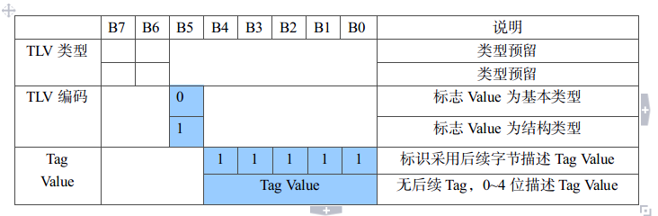

有关TLV协议的相关内容，以及基于C语言的简单实现。都是个人理解，有许多不足，仅供参考(•̀⌄•́)
　　　　　　　　　　　　　　　　　　　　　　　　　　　　　　——　by JiHan
* * *
<!-- more -->

## 概要介绍
首先，关于TLV协议本质，网上有许多讲解，可以先搜索[TLV相关讲解](http://www.wtango.com/tlv%E7%BC%96%E7%A0%81%E9%80%9A%E4%BF%A1%E5%8D%8F%E8%AE%AE%E8%AE%BE%E8%AE%A1/)，我自己的实现思路参考[这篇帖子](https://www.cnblogs.com/tml839720759/archive/2014/07/13/3841820.html)。
这里通俗概括：
T：Type，表示字段标签和编码格式。
L：Length，表示数据长度。
V：Value，表示实际传输内容。

[图片来源](http://www.wtango.com/tlv%E7%BC%96%E7%A0%81%E9%80%9A%E4%BF%A1%E5%8D%8F%E8%AE%AE%E8%AE%BE%E8%AE%A1/)：http://www.wtango.com/

## TLV的优势
而使用TLV的作用是什么呢？概括为将格式数据序列化处理（可能表述不太专业），意思是，方便你在网络中传输结构体。例如：
你想传输结构体：
````
struct Message{    
    unsigned int id; 
    long num;
    char name[128];
};
````

你会开辟一片buf来存放这个结构体，然后传输过去，如果其中有指针，还需要数据整理。
这个思路意味着你传输数据针对的是你结构体中的每一个数据。而如果你要增加一个字段，则需要关注你传输代码的正确与否。例如你增加一个`char new[1024]`那么，你开辟的buf，返回的数据对应，都需要检查。正如你买菜的时候需要关注每一样菜放的位置对不对。
使用TLV的好处，在于将你的传输数据进行打包：

````
T：0x01
L：136
V：
struct Message{    
    unsigned int id; 
    long num;
    char name[128];
};
````
这样你在以TLV格式编写传输代码的时候，就不会关注实际传输内容是什么（当然，int等类型的大小端转换还是要关注的）。仅仅将内容当成一个装满蔬菜的篮子，而非每个蔬菜。这样，你如何更改菜篮子里的蔬菜，对于整个传输过程来说，都不受影响。说白了，就是一个网络传输的通用性封装。┐(´-｀)┌ 

## 简单示例代码
代码参考两篇文章：[TLV简介](https://www.cnblogs.com/tml839720759/archive/2014/07/13/3841820.html) 
[C语言socket编程](https://blog.csdn.net/lovekun1989/article/details/41042273) 其中关于实际数据的大小端转换没有做，在同平台计算机没有影响，后续有空补上。（估计没空，哈哈）

TLV.c:
````
//
// Created by JiHan on 2019/8/26.
//

#include <stdlib.h>
#include <sys/socket.h>
#include <arpa/inet.h>
#include "TLV.h"


int send_tlv(int sk, unsigned char *buf, int buf_len, int status){
    TLV_ENTITY *send_tlv=NULL;
    int tag = sk;

    if (buf == NULL){
        printf("buffer is null!\n");
        return -1;
    }


    send_tlv = (TLV_ENTITY *)malloc(buf_len+TLV_TAG_LEN);
    memset(send_tlv,0,buf_len+TLV_TAG_LEN);

    //把数据整合到TLV结构中
    send_tlv->length = htonl(buf_len);
    send_tlv->tag = htonl(tag);
    send_tlv->value = (unsigned char*)send_tlv +TLV_TAG_LEN;
    memcpy(send_tlv->value,buf,buf_len);

    //发送TLV结构
    send(sk, (char *)send_tlv, sizeof(struct Message)+TLV_TAG_LEN,status);

    if (send_tlv != NULL){
        free(send_tlv);
    }

    return 0;
}

int recv_tlv(int sk, unsigned char *buf, int buf_len, int status){
    TLV_ENTITY send_tlv = {0, 0, NULL};
    int onece = 0, dataNum = 0;
    char tmp_tlv[1024];

    if (buf == NULL){
        printf("buffer is null!\n");
        return -1;
    }

    //获取TLV数据结构头
    onece = recv(sk, tmp_tlv, TLV_TAG_LEN, status);
    memcpy(&send_tlv.tag, tmp_tlv, 4);
    send_tlv.tag = ntohl(send_tlv.tag);
    memcpy(&send_tlv.length, tmp_tlv+4, 4);
    send_tlv.length = ntohl(send_tlv.length);
    send_tlv.value = (unsigned char *) malloc(send_tlv.length);

    //根据头数据接收后续value数据
    while (dataNum < send_tlv.length){
        onece = recv(sk, tmp_tlv, 1024, status);
        memcpy(send_tlv.value + dataNum, tmp_tlv, onece);
        dataNum += onece;
    }

    if(buf_len < send_tlv.length){
        printf("buffer overflow!\n");
        return -1;
    }

    memcpy(buf, send_tlv.value, send_tlv.length);
    if (send_tlv.value != NULL){
        free(send_tlv.value);
    }

    return dataNum;
}
````

TLV.h：
````
//
// Created by JiHan on 2019/8/26.
//

#ifndef __TLV_H__
#define __TLV_H__

#include <stdio.h>
#include <string.h>

#define TLV_TAG_LEN 10


struct Message{
    unsigned int id;
    long num;
    char name[128];
    char hello[24];
    char new[128];
};


int recv_tlv(int sk, unsigned char *buf, int buf_len, int status);
int send_tlv(int sk, unsigned char *buf, int buf_len, int status);

#endif
````

test.c:
````

#include <sys/stat.h>
#include <fcntl.h>
#include <unistd.h>
#include <netdb.h>
#include <sys/types.h>
#include <sys/socket.h>
#include <netinet/in.h>
#include <arpa/inet.h>

#include <stdlib.h>
#include "TLV.h"


#define SERVER_PORT 9111

int server(){
    int sk;
    struct sockaddr_in server_addr, clientAddr;
    int addr_len = sizeof(clientAddr);
    int client;
//    char buffer[200];
    int iDataNum = 0;

    struct Message MSG;
    //char recvbuf[1024];
    //int recvNum;

    if((sk = socket(AF_INET, SOCK_STREAM, 0)) < 0)
    {
        printf("err socket\n");
        return -1;
    }
    memset(&server_addr, 0, sizeof(server_addr));
    //初始化服务器端的套接字，并用htons和htonl将端口和地址转成网络字节序
    server_addr.sin_family = AF_INET;
    server_addr.sin_port = htons(SERVER_PORT);
    //ip可是是本服务器的ip，也可以用宏INADDR_ANY代替，代表0.0.0.0，表明所有地址
    server_addr.sin_addr.s_addr = htonl(INADDR_ANY);
    //对于bind，accept之类的函数，里面套接字参数都是需要强制转换成(struct sockaddr *)
    //bind三个参数：服务器端的套接字的文件描述符，
    if(bind(sk, (struct sockaddr *)&server_addr, sizeof(server_addr)) < 0)
    {
        printf("err connect\n");
        return -1;
    }
    //设置服务器上的socket为监听状态
    if(listen(sk, 5) < 0)
    {
        printf("err listen\n");
        return -1;
    }

    while(1) {
        printf("Listening on port: %d\n", SERVER_PORT);
        //调用accept函数后，会进入阻塞状态
        //accept返回一个套接字的文件描述符，这样服务器端便有两个套接字的文件描述符，
        //serverSocket和client。
        //serverSocket仍然继续在监听状态，client则负责接收和发送数据
        //clientAddr是一个传出参数，accept返回时，传出客户端的地址和端口号
        //addr_len是一个传入-传出参数，传入的是调用者提供的缓冲区的clientAddr的长度，以避免缓冲区溢出。
        //传出的是客户端地址结构体的实际长度。
        //出错返回-1
        client = accept(sk, (struct sockaddr *) &clientAddr, (socklen_t * ) & addr_len);
        if (client < 0) {
            printf("err accept\n");
            continue;
        }
        printf("\nrecv client data...\n");
        //inet_ntoa   ip地址转换函数，将网络字节序IP转换为点分十进制IP
        //表达式：char *inet_ntoa (struct in_addr);
        printf("IP is %s\n", inet_ntoa(clientAddr.sin_addr));
        printf("Port is %d\n", ntohs(clientAddr.sin_port));

        iDataNum = recv_tlv(client, (unsigned char*)&MSG, sizeof(MSG), 0);
        if (iDataNum <= 0) {
            printf("err recv\n");
            break;
        }

        printf("%d  %ld  %s  %s %s\n",MSG.id, MSG.num, MSG.name, MSG.hello, MSG.new);

/*        while (1) {
            iDataNum = recv(client, buffer, 1024, 0);
            if (iDataNum <= 0) {
                printf("err recv\n");
                break;
            }
            buffer[iDataNum] = '\0';
            printf("%drecv data is %s\n", iDataNum, buffer);
            send(client, buffer, iDataNum, 0);
        }*/
        close(client);
    }
    close(sk);
    return 0;

}

int client(){
    //客户端只需要一个套接字文件描述符，用于和服务器通信
    int clientSocket;
    //描述服务器的socket
    struct sockaddr_in serverAddr;
   // char sendbuf[200];
   // char recvbuf[200];
   // int iDataNum;

    struct Message MSG = {100, 54321, "huangjiahao", "world", "tttttest"};

    if((clientSocket = socket(AF_INET, SOCK_STREAM, 0)) < 0)
    {
        printf("err socket\n");
        return 1;
    }

    serverAddr.sin_family = AF_INET;
    serverAddr.sin_port = htons(SERVER_PORT);
    //指定服务器端的ip，本地测试：127.0.0.1
    //inet_addr()函数，将点分十进制IP转换成网络字节序IP
    serverAddr.sin_addr.s_addr = inet_addr("127.0.0.1");
    if(connect(clientSocket, (struct sockaddr *)&serverAddr, sizeof(serverAddr)) < 0)
    {
        printf("err connect\n");
        return 1;
    }
    printf("connect with destination host...\n");

    //数据格式转化为tlv，进行发送
    send_tlv(clientSocket,(unsigned char *)&MSG, sizeof(MSG), 0);

/*    while(1)
    {
        printf("Input your word:>");
        scanf("%s", sendbuf);
        printf("\n");

        send(clientSocket, sendbuf, strlen(sendbuf), 0);
        if(strcmp(sendbuf, "quit") == 0)
            break;
        iDataNum = recv(clientSocket, recvbuf, 200, 0);
        recvbuf[iDataNum] = '\0';
        printf("recv data of my world is: %s\n", recvbuf);
    }*/
    close(clientSocket);
    return 0;

}

int main(int argv, char* arg[]){

    if (argv > 1){
        printf("start client...\n");
        client();
    } else{
        printf("start server...\n");
        server();
    }

    return 0;
}

````

Makefile:
````
# by jihan
DIR_INC = .
DIR_SRC = .
DIR_OBJ = .
DIR_BIN = .

EVENT_LIB = /usr/local/lib
EVENT_INC = /usr/local/include


#ALL_LD = -L${EVENT_LIB}
#ALL_INC = -I${EVENT_INC}
ALL_LIB = -lssl

CXX = g++
CC = gcc
CFLAGS = -g -O2 -Wall -Werror
MPIF90 = mpiif90

SRC = $(wildcard ${DIR_SRC}/*.c)
OBJ = $(patsubst %.c,${DIR_OBJ}/%.o,$(notdir ${SRC}))

TARGET = a.out

BIN_TARGET = ${DIR_BIN}/${TARGET}

.PHONY:all
all: ${BIN_TARGET}

${BIN_TARGET}: ${OBJ}
	$(CC) $(CFLAGS) $(OBJ)  -o $@ $(ALL_LD) $(ALL_LIB)

${DIR_OBJ}/%.o:${DIR_SRC}/%.c
	$(CC) $(CFLAGS)  -c $< -o $@ $(ALL_INC)

.PHONY:clean
clean:
	-rm -f *.out
	-rm -f *.o
#	-rm -f ./ncfile/*.nc


fixed=xy04c
.PHONY:${fixed}
${fixed}: ${fixed}.c
	$(CC) $(CFLAGS) -o $@.out $< $(ALL_LD) $(ALL_INC) $(ALL_LIB)

IN=$(in)
.PHONY:one
one: ${IN}.c
	$(CC) $(CFLAGS) -o ${IN}.out $< $(ALL_LD) $(ALL_INC) $(ALL_LIB)

.PHONY:maketest
maketest:
	-echo ${SRC}
	-echo ${OBJ} ${BIN_TARGET}
	-echo $(notdir ${SRC})

#（1）Makefile中的 符号 $@, $^, $< 的意思：
#　　$@  表示目标文件
#　　$^  表示所有的依赖文件
#　　$<  表示第一个依赖文件
#　　$?  表示比目标还要新的依赖文件列表

#（2）wildcard、notdir、patsubst的意思：
#　　wildcard : 扩展通配符
#　　notdir ： 去除路径
#　　patsubst ：替换通配符

#（3）PHONY 表示伪目标，比如clean，如果文件中
#	  存在clean文件，那么添加了此关键字依旧能
#	  执行rm操作。

````

linux 平台下：
`make`
`./a.out`运行server
`./a.out`运行client