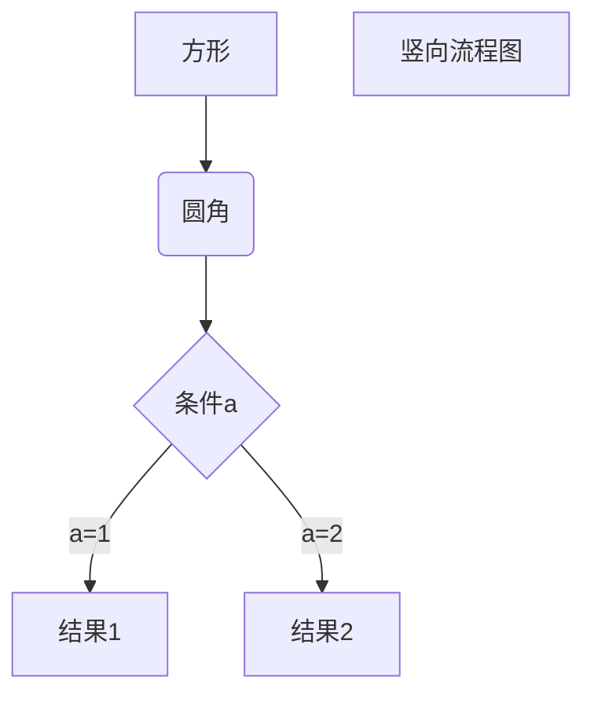
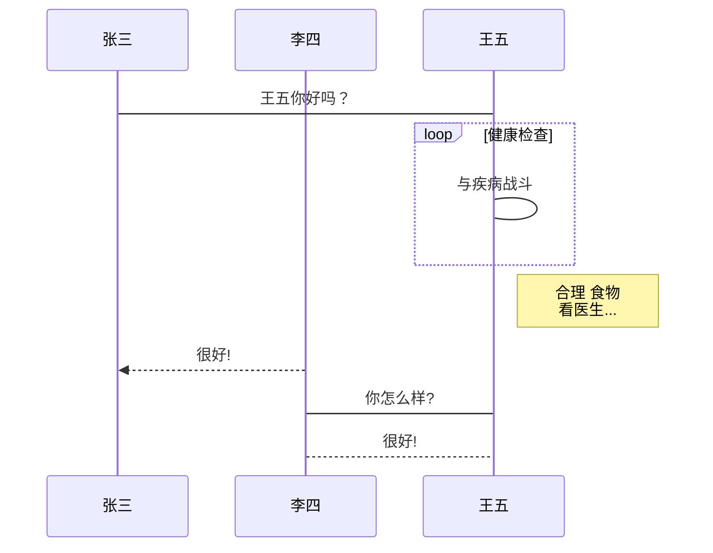
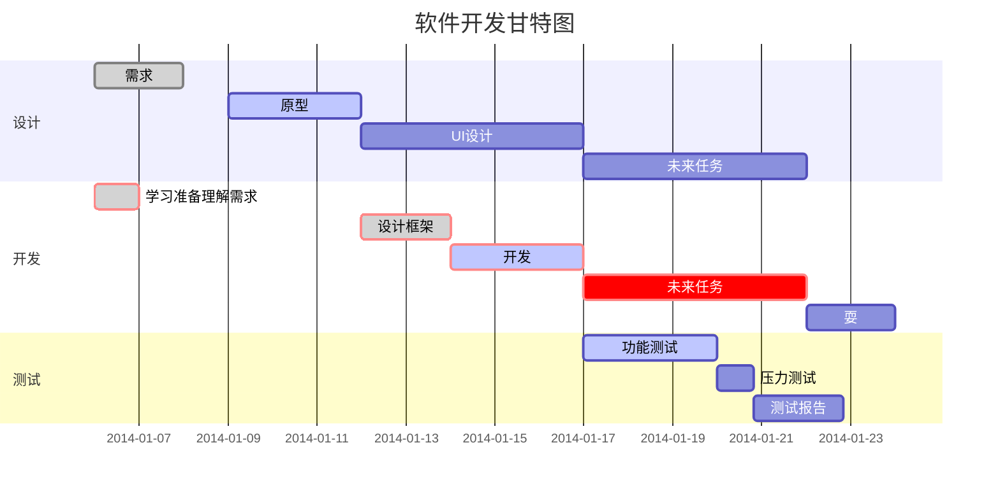

久了不更新博客，就不知道怎么搞环境了，换了环境又得查。索性自己写个简单的(•̀⌄•́)
　　　　　　　　　　　　　　　　　　　　　　　　　　　　　　——　by JiHan
* * *
<!-- more -->

可根据自己的需求进行快速定位，本文对应的发布环境是GitHub

### 从0-1搭建hexo网站
我就不做copper了，直接上链接：
[超详细Hexo+Github博客搭建小白教程](https://godweiyang.com/2018/04/13/hexo-blog/)
[hexo主题next](https://github.com/iissnan/hexo-theme-next)（我自己用的）
[hexo主题推荐](https://www.zhihu.com/question/24422335)
[hexo主题美化1](https://www.jianshu.com/p/3ff20be8574c)
[hexo主题美化2](https://blog.csdn.net/nightmare_dimple/article/details/86661502)
[评论系统](https://valine.js.org/)

### 已有博客，环境迁移
主要是相应环境安装：
1. node.js [官方下载](https://nodejs.org/zh-cn/download/releases/), 我这里选择的是12.x的版本。
   windows直接点安装
   Linux下载解压后，配置路径`export PATH=$PATH:xxxx/node-v14.10.0-linux-x64/bin`
2. git安装
   windows直接点安装
   Liunx `sudo yum install git`或`sudo apt install git`
3. 安装hexo
   ```
   npm i hexo-cli -g

    #配置git扩展，在你自己的博客里肯定已经配置了项目地址关联
   npm i hexo-deployer-git
   ```
4. 可能有必要
   如果项目里没有node_modules文件夹，需要到博客根目录重新安装一波：`npm install`


### 已有环境，新发文
发文常用命令(通常都是顺序执行)：
```
# 新建文章
hexo new post "article title"
# 生成博客网页文件
hexo g  
# 本地预览博客
hexo s  
hexo s -i 0.0.0.0 -p 8080 #指定监听地址端口
# 上传网页文件到github
hexo d  
```
博客源码备份：
```
hexo clean
git add -u
git commit -m "new post"
git push
```

### 常用Markdown语法
主要针对GitHub，参考[官方文档](https://docs.github.com/cn/free-pro-team@latest/github/writing-on-github/basic-writing-and-formatting-syntax)
*注意语法中的空格*

#### 标题
```
# 最大标题
## 第二大标题
###### 最小标题
```

#### 样式文本

|样式	|语法|
|---|---|
|粗体|	** ** 或 __ __	|
|斜体|	* * 或 _ _	||
|删除线|	~~ ~~		|
|粗体和嵌入的斜体|	** ** 和 _ _|
|全部粗体和斜体|	*** ***|

#### 引用文本
```
> 引用的文本
```
#### 引用代码
```
`单行代码引用`
```

````
```json(代码类型)
 多行代码引用
```
````
如果想在代码块中显示\`\`\`, 只需要外层的\` 比内层的多即可：
`````
```` 代码块标识
```json
显示的代码
```
````
`````

#### 链接
```
[普通链接](https://jihanhuang.github.io/)

[下载链接](./《mysql必知必会》读书笔记/mysql_scripts.zip)
[文章导航链接](#已有博客环境迁移)
```

#### 列表
```
1. James Madison
2. James Monroe
3. John Quincy Adams
```
`*`或`-`都可以
```
- George Washington
- John Adams
- Thomas Jefferson
```
嵌套(子列表的`-`需在父列表的第一个字下)
```
1. 第一个列表项
   -  第一个嵌套列表项
     - 第二个嵌套列表项
```
任务：
```
- [x] 完成更改
- [ ] 推送提交到 GitHub
- [ ] 打开拉取请求
- [ ] \(Optional) 规避[]后的()
```

#### 表格
```
|列标题	|列标题|
|---|---|
|数据11|	数据21 <br> br表示换行	|
|数据12|	数据22	|
```

#### 绘图
hexo自身都不支持Markdown标准绘图和Mermaid。需要进行配置：
执行以下命令：
```shell
npm install --save hexo-filter-mermaid-diagrams
npm install --save hexo-filter-sequence
npm install --save hexo-filter-flowchart
```
Mermaid配置可以阅读：[Hexo中引入Mermaid流程图](https://tyloafer.github.io/posts/7790/)，引用部分如下：

> Mermaid还需要进行配置(根目录下_config.yml)，增加如下内容：
> ```
> # mermaid chart
> mermaid: ## mermaid url https://github.com/knsv/mermaid
>   enable: true  # default true
>   version: "7.1.2" # default v7.1.2
>   options:  # find more api options from https://github.com/knsv/mermaid/blob/master/src/mermaidAPI.js
>     #startOnload: true  // default true
> ```
> 以及修改js，我这里使用的是`next`主题。在文件`themes/next/layout/_partials/footer.swig`后>加上：
> ```
> 
>   <script src='https://unpkg.com/mermaid@{{ theme.mermaid.version }}/dist/mermaid.min.js'></script>
>   <script>
>     if (window.mermaid) {
>       mermaid.initialize({theme: 'forest'});
>     }
>   </script>
> 
> ```


语法绘图：
graphviz：较为复杂，特别是时序图，但功能强大。[graphviz在线绘图](https://sketchviz.com/new)，[graphviz dot语法总结](https://onlookerliu.github.io/2017/12/28/dot%E8%AF%AD%E6%B3%95%E6%80%BB%E7%BB%93/#1-%E7%AE%80%E4%BB%8B)
plantuml：绘图风格单一(个人不觉得丑)，但画时序图很快，模板多，本体使用需要java支持。[plantmul在线绘图](https://www.planttext.com/)：多个模板供选择。能接受画面的，还是推荐使用
Mermaid：功能简单，绘图较快，美观度还可以，很多Markdown编辑器都支持。[语法](https://mermaid-js.github.io/mermaid/#/)，个人使用感觉功能太少(可能是插件支持不友好)
##### 示例
*[来源](https://www.runoob.com/markdown/md-advance.html)*
**Markdown标准支持：**
流程图：

`````
```flow
st=>start: 开始框
op=>operation: 处理框
cond=>condition: 判断框(是或否?)
sub1=>subroutine: 子流程
io=>inputoutput: 输入输出框
e=>end: 结束框
st->op->cond
cond(yes)->io->e
cond(no)->sub1(right)->op
```
`````

效果：
```flow
st=>start: 开始框
op=>operation: 处理框
cond=>condition: 判断框(是或否?)
sub1=>subroutine: 子流程
io=>inputoutput: 输入输出框
e=>end: 结束框
st->op->cond
cond(yes)->io->e
cond(no)->sub1(right)->op
```

流程图(横向)：
````
```flow
st=>start: 开始框
op=>operation: 处理框
cond=>condition: 判断框(是或否?)
sub1=>subroutine: 子流程
io=>inputoutput: 输入输出框
e=>end: 结束框
st(right)->op(right)->cond
cond(yes)->io(bottom)->e
cond(no)->sub1(right)->op
```
````

效果：
```flow
st=>start: 开始框
op=>operation: 处理框
cond=>condition: 判断框(是或否?)
sub1=>subroutine: 子流程
io=>inputoutput: 输入输出框
e=>end: 结束框
st(right)->op(right)->cond
cond(yes)->io(bottom)->e
cond(no)->sub1(right)->op
```
UML样例：
````
```sequence
对象A->对象B: 对象B你好吗?（请求）
Note right of 对象B: 对象B的描述
Note left of 对象A: 对象A的描述(提示)
对象B-->对象A: 我很好(响应)
对象A->对象B: 你真的好吗？
```
````

效果：
```sequence
对象A->对象B: 对象B你好吗?（请求）
Note right of 对象B: 对象B的描述
Note left of 对象A: 对象A的描述(提示)
对象B-->对象A: 我很好(响应)
对象A->对象B: 你真的好吗？
```
UML复杂样例：
````
```sequence
Title: 标题：复杂使用
对象A->对象B: 对象B你好吗?（请求）
Note right of 对象B: 对象B的描述
Note left of 对象A: 对象A的描述(提示)
对象B-->对象A: 我很好(响应)
对象B->小三: 你好吗
小三-->>对象A: 对象B找我了
对象A->对象B: 你真的好吗？
Note over 小三,对象B: 我们是朋友
participant C
Note right of C: 没人陪我玩
```
````

效果：
```sequence
Title: 标题：复杂使用
对象A->对象B: 对象B你好吗?（请求）
Note right of 对象B: 对象B的描述
Note left of 对象A: 对象A的描述(提示)
对象B-->对象A: 我很好(响应)
对象B->小三: 你好吗
小三-->>对象A: 对象B找我了
对象A->对象B: 你真的好吗？
Note over 小三,对象B: 我们是朋友
participant C
Note right of C: 没人陪我玩
```

**Mermaid：**
[语法](https://mermaid-js.github.io/mermaid/#/)
流程图：
````

````

效果：

UML样例：
````

````

效果：


甘特图：
````

````

效果：


#### 段落
通过在文本行之间留一个空白行，可创建新段落。

#### 忽略Markdown格式
1. 使用代码块
2. 使用`\`

#### 使用表情符号
通过键入 `:EMOJICODE:` 可在您的写作中添加表情符号。
比如`:+1:` :+1:  
hexo默认是不支持表情符号的，因此我在[这儿](https://novnan.github.io/Hexo/emojis-for-hexo-next/)找到了解决方案：
> 安装
> ```
> npm install hexo-filter-github-emojis --save
> ```
> 打开配置文件(根目录下的`_config.yml`文件)，并增加：
> ```
> githubEmojis:
>   enable: true
>   className: github-emoji
>   unicode: false
>   styles:
>   localEmojis:
> ```
> GitHubEmojis更多配置参考[文档](https://github.com/crimx/hexo-filter-github-emojis)

更多表情符号参考[emoji-cheat-sheet](https://www.webfx.com/tools/emoji-cheat-sheet/) :sunglasses: 

### 可能遇到问题
**发布图片视频音频：**
图片发布很简单：
你在`hexo new post "xxx"`会在__posts下生成一个对应xxx.md和一个xxx文件夹。图片放在文件夹里，文章里引用：
```

```
[视频发布](https://www.jianshu.com/p/26a7fc7cc185)
**github配置域名发布后被清空：**
在对应source目录下新建一个CNAME文件，只放置一行你指向的域名。例如：
```
# tree Blog/source/ -L 1
Blog/source/
|-- categories
|-- CNAME
|-- download
|-- _posts
|-- tags
`-- uploads
# cat Blog/source/CNAME 
xxx.com
```
