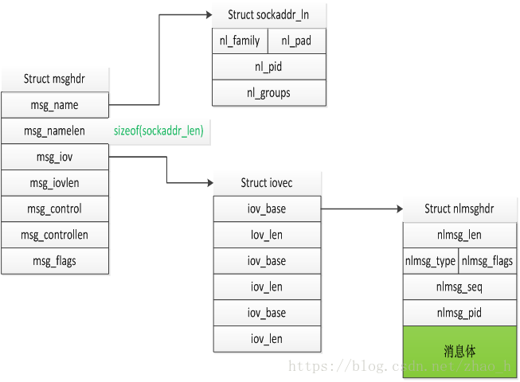

这里列出了一些ipset消息通信的格式，并且附加了ipset命令的debug版本。(•̀⌄•́)
　　　　　　　　　　　　　　　　　　　　　　　　　　　　　　——　by JiHan
* * *

*先看之前的*

<!-- more -->

源码分析里讲解了ipset的通信机制，这里主要是列出一些示例。也就是ipset通信时的消息体部分。再挂一下这张图：

*[图片来源](https://blog.csdn.net/zhao_h/article/details/80943226)*

**示例**
尝试运行命令`ipset list test_net`得到：
``` shell
[root@localhost jihan]# ./ipset list test_net
Name: test_net
Type: hash:net
Revision: 1
Header: family inet hashsize 1024 maxelem 65536
Size in memory: 16816
References: 0
Members:
1.1.2.0/31
```
*当然test_net是我之前就添加好了的。这里只是举例，是个ipset正确命令就行。*
这里显示的就是正常ipset命令下的运行结果，我编译了一个ipset的[debug版本](/download/ipset_DD)(对应源码libipset7.6)，并且加了一些打印，可以得到一下信息：
```
Message header: received cmd  LIST (7)
	len 140
	flag EXIST
	seq 1589773040
	Command attributes:
	PROTOCOL: 6
	SETNAME: test_net
	TYPENAME: hash:net
	REVISION: 1
	FAMILY: 2
		CREATE attributes:
		HASHSIZE: 1024
		MAXELEM: 65536
		REFERENCES: 0
		MEMSIZE: 16816
		ADT attributes:
		IP: 1.1.2.0
		CIDR: 31
Recv hdr:
0x8c 0x00 0x00 0x00 0x07 0x06 0x02 0x00 0xf0 0x02 0xc2 0x5e 0xe5 0x2b 0x01 0x00 
Recv msg:
0x02 0x00 0x00 0x00 //ex header
0x05 0x00 0x01 0x00 0x06 0x00 0x00 0x00  //PROTOCOL
0x0d 0x00 0x02 0x00 0x74 0x65 0x73 0x74 0x5f 0x6e 0x65 0x74 0x00 0x00 0x00 0x00 //SETNAME
0x0d 0x00 0x03 0x00 0x68 0x61 0x73 0x68 0x3a 0x6e 0x65 0x74 0x00 0x00 0x00 0x00 //TYPENAME
0x05 0x00 0x05 0x00 0x02 0x00 0x00 0x00 //FAMILY
0x05 0x00 0x04 0x00 0x01 0x00 0x00 0x00 //REVISION
0x24 0x00 0x07 0x80 //DATA
	0x08 0x00 0x12 0x40 0x00 0x00 0x04 0x00 
	0x08 0x00 0x13 0x40 0x00 0x01 0x00 0x00 
	0x08 0x00 0x19 0x40 0x00 0x00 0x00 0x00 
	0x08 0x00 0x1a 0x40 0x00 0x00 0x41 0xb0 
0x1c 0x00 0x08 0x80 //ADT
	0x18 0x00 0x07 0x80 //DATA
		0x0c 0x00 0x01 0x80 //IP
			0x08 0x00 0x01 0x00 0x01 0x01 0x02 0x00 //1.1.2.0
		0x05 0x00 0x03 0x00 0x1f 0x00 0x00 0x00 //CIDR
```
其中单个属性的组成模式类似tlv结构()，不过这里是ltv结构。比如`0x05 0x00 0x01 0x00 0x06 0x00 0x00 0x00`中`0x05 0x00`是指长度为5，`0x01 0x00`是标志PROTOCOL(源码里有映射表)，后面的就是值了，这里的实际传输长度为8，是因为进行了对齐操作。

如果你需要进行其他ipset通信的分析，执行上面提到的ipset的debug版本对应命令，进行解析即可。