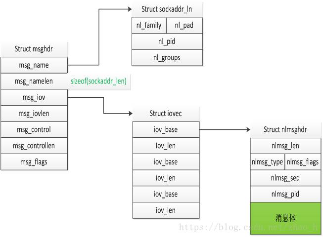

由于语言需求，需要使用go实现libipset的功能，与内核通信，就简单的看了一下源码(•̀⌄•́)
　　　　　　　　　　　　　　　　　　　　　　　　　　　　　　——　by JiHan
* * *
*[ipset官网](http://ipset.netfilter.org/)*  
*[libipset手册](http://ipset.netfilter.org/libipset.man.html)*
*[libmnl](https://netfilter.org/projects/libmnl/)*

*本文主要根据ipset 7.x版本来进行介绍的。*

<!-- more -->

### 简单介绍
#### 简介
ipset是 Linux 防火墙 iptables 的一个协助工具。 通过这个工具可以轻松愉快地屏蔽一组IP地址。--[来自wiki](https://wiki.archlinux.org/index.php/Ipset_(%E7%AE%80%E4%BD%93%E4%B8%AD%E6%96%87))
ipset主要解决的是iptables在屏蔽大量ip产生的效率低下问题。搞一张图看看效率差距：

--[测评来源](http://people.netfilter.org/kadlec/nftest.pdf)
并且，iptables在进行规则插入和删除的时候，也只能一条条的进行，速度也是非常慢的。我自己在自己的设备上测试效果如下(time + 脚本测试的)：
| 添加Iptables数量 | 1	| 500	| 1000 |	2000 |	4000	| 10000 |
| ------------- | ------------- | ------------- | ------------- |------------ | ------------- | ------------- | ------------- |
| 花费时间 |0.002s	|2.831s	|4.115s|	10.725s	|33.365s|	2m55.954s|
**那么**，如果你有需求使用iptables屏蔽大量的ip，就可以考虑使用ipset。
#### 使用
看源码之前，首先需要了解ipset有什么用，简单给个示例来屏蔽一个ip：
你要有两台机器，可以是自己的虚拟机，在一台机器上配置ipset + iptables，另外一台机器去ping测试。
安装(centos)：`yum install ipset`
```shell
ipset create hash_test hash:ip #创建一个集合
ipset add hash_test 192.168.1.120 #添加一个成员到集合
iptables -I INPUT -m set --match-set hash_test src -j DROP  #iptables配置匹配项
```
你也可以进行更多的尝试，参见[官网](http://ipset.netfilter.org/)
ipset的使用不是本文主要目的，简单给个示例就行了。
### 基本流程
libipset属于用户态部分的代码，负责与内核通信，真正的ipset工作的地方是在内核的netfilter中。
我们就根据上面`ipset create hash_test hash:ip`命令来分析大概的流程。

特殊说明在流程图里都有备注，顺便说明一下几个固定列表的位置：
* 各种类型的类型列表，包含所支持的命令，以及需要的参数：ipset_<type_name>.c
  
* 错误码：errcode.c
  
* 输入命令参数列表(主要是-s这种类型的参数)：ipset.c
  
* 输入命令参数列表(主要是add这种类型的参数)：args.c
  
* 某个命令的消息协议：PROTOCOL
  

### 消息格式
ipset使用的消息是Netlink通信，在ipset用户态构造的sock参数：AF_NETLINK，SOCK_RAW，NETLINK_NETFILTER，sock具体用法自己去查。ipset用户态构造的sock需要进行bind才能使用，因为它不能像udp这种自动分配发送端的端口。
首先来看看netlink的消息格式([主要参考](https://www.cnblogs.com/wenqiang/p/6306727.html))：
`struct sockaddr_nl`结构:
``` c
struct sockaddr_nl {
     __kernel_sa_family_t    nl_family;  /* AF_NETLINK （跟AF_INET对应）*/
     unsigned short  nl_pad;     /* zero */
     __u32       nl_pid;     /* port ID  （通信端口号）*/
     __u32       nl_groups;  /* multicast groups mask */
};
```
`struct nlmsghd` 结构：
``` c
/* struct nlmsghd 是netlink消息头*/
struct nlmsghdr {   
    __u32       nlmsg_len;  /* Length of message including header */
    __u16       nlmsg_type; /* Message content */
    __u16       nlmsg_flags;    /* Additional flags */ 
    __u32       nlmsg_seq;  /* Sequence number */
    __u32       nlmsg_pid;  /* Sending process port ID */
};
```
通常这个头消息的构造，在ipset中是下面的代码(其中seq是一个自增检验数，pid通常设置0)：
``` c
static void
ipset_mnl_fill_hdr(struct ipset_handle *handle, enum ipset_cmd cmd,
		   void *buffer, size_t len UNUSED, uint8_t envflags)
{
	struct nlmsghdr *nlh;
	struct nfgenmsg *nfg;

	assert(handle);
	assert(buffer);
	assert(cmd > IPSET_CMD_NONE && cmd < IPSET_MSG_MAX);

	nlh = mnl_nlmsg_put_header(buffer);
	nlh->nlmsg_type = cmd | (NFNL_SUBSYS_IPSET << 8);
	nlh->nlmsg_flags = cmdflags[cmd - 1];
	if (envflags & IPSET_ENV_EXIST)
		nlh->nlmsg_flags &=  ~NLM_F_EXCL;

        //这儿是扩展头，通常是固定的\x02\x00\x00\x00
	nfg = mnl_nlmsg_put_extra_header(nlh, sizeof(struct nfgenmsg));
	nfg->nfgen_family = AF_INET;
	nfg->version = NFNETLINK_V0;
	nfg->res_id = htons(0);
}
```
`struct msghdr` 结构:
``` c
struct iovec {                    /* Scatter/gather array items */
     void  *iov_base;              /* Starting address */
     size_t iov_len;               /* Number of bytes to transfer */
 };
  /* iov_base: iov_base指向数据包缓冲区，即参数buff，iov_len是buff的长度。msghdr中允许一次传递多个buff，
    以数组的形式组织在 msg_iov中，msg_iovlen就记录数组的长度 （即有多少个buff）
  */
 struct msghdr {
     void         *msg_name;       /* optional address */
     socklen_t     msg_namelen;    /* size of address */
     struct iovec *msg_iov;        /* scatter/gather array */
     size_t        msg_iovlen;     /* # elements in msg_iov */
     void         *msg_control;    /* ancillary data, see below */
     size_t        msg_controllen; /* ancillary data buffer len */
     int           msg_flags;      /* flags on received message */
 };
 /* msg_name： 数据的目的地址，网络包指向sockaddr_in, netlink则指向sockaddr_nl;
    msg_namelen: msg_name 所代表的地址长度
    msg_iov: 指向的是缓冲区数组
    msg_iovlen: 缓冲区数组长度
    msg_control: 辅助数据，控制信息(发送任何的控制信息)
    msg_controllen: 辅助信息长度
    msg_flags: 消息标识
 */
```
这个结构体主要在ipset接收消息的时候使用。具体代码包含在libmnl库中，需要[下载源码](https://netfilter.org/projects/libmnl/downloads.html)。然后就可以看到以下的接收消息的函数：
``` c
ssize_t mnl_socket_recvfrom(const struct mnl_socket *nl, void *buf,
			    size_t bufsiz)
{
	ssize_t ret;
	struct sockaddr_nl addr;
	struct iovec iov = {
		.iov_base	= buf,
		.iov_len	= bufsiz,
	};
	struct msghdr msg = {
		.msg_name	= &addr,
		.msg_namelen	= sizeof(struct sockaddr_nl),
		.msg_iov	= &iov,
		.msg_iovlen	= 1,
		.msg_control	= NULL,
		.msg_controllen	= 0,
		.msg_flags	= 0,
	};
	ret = recvmsg(nl->fd, &msg, 0);
	if (ret == -1)
		return ret;

	if (msg.msg_flags & MSG_TRUNC) {
		errno = ENOSPC;
		return -1;
	}
	if (msg.msg_namelen != sizeof(struct sockaddr_nl)) {
		errno = EINVAL;
		return -1;
	}
	return ret;
}
```
上述的netlink消息数据结构，也就是ipset里使用的主要结构，而这些消息结构的关系如下：

*[图片来源](https://blog.csdn.net/zhao_h/article/details/80943226)*
上述示例的就是ipset中使用到的主要消息结构了，更多细节，还是在源码中查看。
### 示例Demo
这里我们列出两个语言的demo，C和Go的。
#### C
c的相对简单，因为只需要调用libipset提供的接口就行。这里推荐写法和官方的ipset的main函数写法一致。
**官方main函数**(这个函数只有在ipset 7版本中才有)
``` c
#include <assert.h>			/* assert */
#include <stdio.h>			/* fprintf */
#include <stdlib.h>			/* exit */

#include <config.h>
#include <libipset/ipset.h>		/* ipset library */

int
main(int argc, char *argv[])
{
	struct ipset *ipset;
	int ret;

	/* Load set types */
	ipset_load_types();

	/* Initialize ipset library */
	ipset = ipset_init();
	if (ipset == NULL) {
		fprintf(stderr, "Cannot initialize ipset, aborting.");
		exit(1);
	}

	ret = ipset_parse_argv(ipset, argc, argv);

	ipset_fini(ipset);

	return ret;
}
```
是不是简单到爆。
**第二种**，是使用libipset中的session结构体([参考来源](https://github.com/Lekensteyn/dnsallow/blob/master/ipset.c))：
``` c
#include <stdint.h>
#include <stdbool.h>
#include <stdlib.h>
#include <libipset/types.h>
#include <libipset/session.h>
#include <libipset/data.h>
#include <netinet/in.h>   
#include <arpa/inet.h>

/* Setname X which can be used in "ipset list X". */
#define SETNAME_IPV4 "ipset-ipv4"
#define SETNAME_IPV6 "ipset-ipv6"

struct ipset_state {
    struct ipset_session *session;
};

struct address {
    int family;
    union {
        struct in_addr ip4_addr;
        struct in6_addr ip6_addr;
    };
};

static bool try_ipset_cmd(struct ipset_session *session, enum ipset_cmd cmd,
		        const char *setname, int family, const void *addr)
{
    ipset_session_data_set(session, IPSET_SETNAME, setname);
    if (!ipset_type_get(session, cmd)) {
	        fprintf(stderr, "Cannot find ipset %s: %s\n", setname,
					                ipset_session_error(session));
	        return false;
	    }
    ipset_session_data_set(session, IPSET_OPT_FAMILY, &family);
    ipset_session_data_set(session, IPSET_OPT_IP, addr);

    if (ipset_cmd(session, cmd, /*lineno*/ 0)) {
	        fprintf(stderr, "Failed to add to set %s: %s\n", setname,
					                ipset_session_error(session));
	        return false;
	    }
    return true;
}

static bool try_ipset_create(struct ipset_session *session, const char *setname,
		        const char *typename, int family)
{
    const struct ipset_type *type;
    uint32_t timeout;

    ipset_session_data_set(session, IPSET_SETNAME, setname);
    ipset_session_data_set(session, IPSET_OPT_TYPENAME, typename);
    type = ipset_type_get(session, IPSET_CMD_CREATE);
    if (type == NULL) {
	        fprintf(stderr, "Cannot find ipset type %s: %s\n", typename,
					                ipset_session_error(session));
	        return false;
	    }

    timeout = 0; /* timeout support, but default to infinity */
    ipset_session_data_set(session, IPSET_OPT_TIMEOUT, &timeout);
    ipset_session_data_set(session, IPSET_OPT_TYPE, type);
    ipset_session_data_set(session, IPSET_OPT_FAMILY, &family);

    if (ipset_cmd(session, IPSET_CMD_CREATE, /*lineno*/ 0)) {
	        fprintf(stderr, "Failed to create ipset %s: %s\n", setname,
					                ipset_session_error(session));
	        return false;
	    }
    return true;
}

struct ipset_state *ipset_init(void)
{
    struct ipset_state *state;

    state = malloc(sizeof(*state));
    if (!state)
        return NULL;

    ipset_load_types();

    state->session = ipset_session_init(printf);
    if (!state->session) {
	        fprintf(stderr, "Cannot initialize ipset session.\n");
	        goto err_session;
	    }

    /* Return success on attempts to create a compatible ipset or attempts to
	 *      * add an existing rule. */
    ipset_envopt_parse(state->session, IPSET_ENV_EXIST, NULL);

    if (!try_ipset_create(state->session, SETNAME_IPV4, "hash:ip", NFPROTO_IPV4))
        goto err_set;
    if (!try_ipset_create(state->session, SETNAME_IPV6, "hash:ip", NFPROTO_IPV6))
        goto err_set;

    return state;

err_set:
err_session:
    ipset_session_fini(state->session);
    free(state);
    return NULL;
}

void ipset_add_ip(struct ipset_state *state, struct address *addr)
{
    struct ipset_session *session = state->session;

    switch (addr->family) {
	    case AF_INET:
	        try_ipset_cmd(session, IPSET_CMD_ADD, SETNAME_IPV4, NFPROTO_IPV4, &addr->ip4_addr);
	        break;
	    case AF_INET6:
	        try_ipset_cmd(session, IPSET_CMD_ADD, SETNAME_IPV6, NFPROTO_IPV6, &addr->ip6_addr);
	        break;
	    default:
	        fprintf(stderr, "Unrecognized address family 0x%04x\n", addr->family);
	        return;
	    }
    ipset_session_report_reset(session);
}

void ipset_fini(struct ipset_state *state)
{
    ipset_session_fini(state->session);
    free(state);
}


//for test
int main(){
    struct address addr;
    addr.family = AF_INET;
    inet_aton("192.168.1.10", &addr.ip4_addr);
    struct ipset_state *state = ipset_init();
    ipset_add_ip(state, &addr);
    ipset_fini(state);
	return 0;
}

```
**编译**(根据各自的环境调整)：
``` shell
gcc -g -O2 -Wall -Werror -c ipset_test.c -o ipset_test.o
gcc -g -O2 -Wall -Werror ./ipset_test.o -o a.out -L/usr/lib64/ -lipset
```
#### GO
go有三种方式来调用ipset，第一种是用执行命令的方式，第二种是使用cgo的方式，第三种是使用netlink通信的方式。这里简单给下第二种和第三种的demo：
**cgo：**
ipset.go:
``` go
package main

// #cgo LDFLAGS: -L${SRCDIR}/ -Wl,-rpath,${SRCDIR}/ -lcipset -L/usr/lib64/  -lipset
// #include <stdlib.h>
// #include "cipset.h"
import (
	"C"
)
import "unsafe"

func main() {
	cip := C.CString("10.92.2.100")
	defer C.free(unsafe.Pointer(cip))
	var caddr C.struct_address
	C.ip2addr(cip, &caddr)
	//caddr.family = C.AF_INET
	//C.inet_aton(cip, caddr.ip4_addr)
	var cstate *C.struct_ipset_state = C.ipset_init()
	C.ipset_add_ip(cstate, &caddr)
	C.ipset_fini(cstate)
}
```
cipset.h
``` c
#ifndef __cipset
#define __cipset

/* Setname X which can be used in "ipset list X". */
#define SETNAME_IPV4 "ipset-ipv4"
#define SETNAME_IPV6 "ipset-ipv6"

struct ipset_state;
struct address;

struct ipset_state *ipset_init(void);
void ipset_add_ip(struct ipset_state *state, struct address *addr);
void ipset_fini(struct ipset_state *state);
void ip2addr(char *ip, struct address *addr);

#endif
```
cipset.c 和上面的C第二种示例代码一致，这里就不占空间了。

**编译执行：**
```
gcc -g -O2 -Wall -Werror -rdynamic -fPIC -shared -o ./libcipset.so ./cipset.c  #动态库生成
go run ipset.go  #执行go程序
```
**go-netlink**([主要参考](https://github.com/nadoo/glider/blob/master/ipset/ipset_linux.go))
```go
// Apache License 2.0
// @mdlayher https://github.com/mdlayher/netlink
// Ref: https://github.com/vishvananda/netlink/blob/master/nl/nl_linux.go

package ipset

import (
	"bytes"
	"encoding/binary"
	"errors"
	"net"
	"strings"
	"sync"
	"sync/atomic"
	"syscall"
	"unsafe"

	"github.com/nadoo/glider/common/log"
	"github.com/nadoo/glider/rule"
)

// NFNL_SUBSYS_IPSET netfilter netlink message types
// https://github.com/torvalds/linux/blob/9e66317d3c92ddaab330c125dfe9d06eee268aff/include/uapi/linux/netfilter/nfnetlink.h#L56
const NFNL_SUBSYS_IPSET = 6

// IPSET_PROTOCOL The protocol version
// http://git.netfilter.org/ipset/tree/include/libipset/linux_ip_set.h
const IPSET_PROTOCOL = 6

// IPSET_MAXNAMELEN The max length of strings including NUL: set and type identifiers
const IPSET_MAXNAMELEN = 32

// Message types and commands
const (
	IPSET_CMD_CREATE = 2
	IPSET_CMD_FLUSH  = 4
	IPSET_CMD_ADD    = 9
	IPSET_CMD_DEL    = 10
)

// Attributes at command level
const (
	IPSET_ATTR_PROTOCOL = 1 /* 1: Protocol version */
	IPSET_ATTR_SETNAME  = 2 /* 2: Name of the set */
	IPSET_ATTR_TYPENAME = 3 /* 3: Typename */
	IPSET_ATTR_REVISION = 4 /* 4: Settype revision */
	IPSET_ATTR_FAMILY   = 5 /* 5: Settype family */
	IPSET_ATTR_DATA     = 7 /* 7: Nested attributes */
)

// CADT specific attributes
const (
	IPSET_ATTR_IP   = 1
	IPSET_ATTR_CIDR = 3
)

// IP specific attributes
const (
	IPSET_ATTR_IPADDR_IPV4 = 1
	IPSET_ATTR_IPADDR_IPV6 = 2
)

// ATTR flags
const (
	NLA_F_NESTED        = (1 << 15)
	NLA_F_NET_BYTEORDER = (1 << 14)
)

var nextSeqNr uint32
var nativeEndian binary.ByteOrder

// Manager struct
type Manager struct {
	fd  int
	lsa syscall.SockaddrNetlink

	domainSet sync.Map
}

// NewManager returns a Manager
func NewManager(rules []*rule.Config) (*Manager, error) {
	fd, err := syscall.Socket(syscall.AF_NETLINK, syscall.SOCK_RAW, syscall.NETLINK_NETFILTER)
	if err != nil {
		log.F("%s", err)
		return nil, err
	}
	// defer syscall.Close(fd)

	lsa := syscall.SockaddrNetlink{
		Family: syscall.AF_NETLINK,
	}

	err = syscall.Bind(fd, &lsa)
	if err != nil {
		log.F("%s", err)
		return nil, err
	}

	m := &Manager{fd: fd, lsa: lsa}

	// create ipset
	for _, r := range rules {
		if r.IPSet != "" {
			CreateSet(fd, lsa, r.IPSet)
		}
	}

	// init ipset
	for _, r := range rules {
		if r.IPSet != "" {
			for _, domain := range r.Domain {
				m.domainSet.Store(domain, r.IPSet)
			}
			for _, ip := range r.IP {
				AddToSet(fd, lsa, r.IPSet, ip)
			}
			for _, cidr := range r.CIDR {
				AddToSet(fd, lsa, r.IPSet, cidr)
			}
		}
	}

	return m, nil
}

// AddDomainIP implements the DNSAnswerHandler function, used to update ipset according to domainSet rule
func (m *Manager) AddDomainIP(domain, ip string) error {
	if domain == "" || ip == "" {
		return errors.New("please specify the domain and ip address")
	}

	domainParts := strings.Split(domain, ".")
	length := len(domainParts)
	for i := length - 1; i >= 0; i-- {
		domain := strings.Join(domainParts[i:length], ".")

		// find in domainMap
		if ipset, ok := m.domainSet.Load(domain); ok {
			AddToSet(m.fd, m.lsa, ipset.(string), ip)
		}
	}

	return nil
}

// CreateSet create a ipset
func CreateSet(fd int, lsa syscall.SockaddrNetlink, setName string) {
	if setName == "" {
		return
	}

	if len(setName) > IPSET_MAXNAMELEN {
		log.Fatal("ipset: name too long")
	}

	log.F("ipset create %s hash:net", setName)

	req := NewNetlinkRequest(IPSET_CMD_CREATE|(NFNL_SUBSYS_IPSET<<8), syscall.NLM_F_REQUEST)

	// TODO: support AF_INET6
	req.AddData(NewNfGenMsg(syscall.AF_INET, 0, 0))
	req.AddData(NewRtAttr(IPSET_ATTR_PROTOCOL, Uint8Attr(IPSET_PROTOCOL)))
	req.AddData(NewRtAttr(IPSET_ATTR_SETNAME, ZeroTerminated(setName)))
	req.AddData(NewRtAttr(IPSET_ATTR_TYPENAME, ZeroTerminated("hash:net")))
	req.AddData(NewRtAttr(IPSET_ATTR_REVISION, Uint8Attr(1)))
	req.AddData(NewRtAttr(IPSET_ATTR_FAMILY, Uint8Attr(2)))
	req.AddData(NewRtAttr(IPSET_ATTR_DATA|NLA_F_NESTED, nil))

	err := syscall.Sendto(fd, req.Serialize(), 0, &lsa)
	if err != nil {
		log.F("%s", err)
	}

	FlushSet(fd, lsa, setName)
}

// FlushSet flush a ipset
func FlushSet(fd int, lsa syscall.SockaddrNetlink, setName string) {
	log.F("ipset flush %s", setName)

	req := NewNetlinkRequest(IPSET_CMD_FLUSH|(NFNL_SUBSYS_IPSET<<8), syscall.NLM_F_REQUEST)

	// TODO: support AF_INET6
	req.AddData(NewNfGenMsg(syscall.AF_INET, 0, 0))
	req.AddData(NewRtAttr(IPSET_ATTR_PROTOCOL, Uint8Attr(IPSET_PROTOCOL)))
	req.AddData(NewRtAttr(IPSET_ATTR_SETNAME, ZeroTerminated(setName)))

	err := syscall.Sendto(fd, req.Serialize(), 0, &lsa)
	if err != nil {
		log.F("%s", err)
	}

}

// AddToSet adds an entry to ipset
func AddToSet(fd int, lsa syscall.SockaddrNetlink, setName, entry string) {
	if setName == "" {
		return
	}

	if len(setName) > IPSET_MAXNAMELEN {
		log.F("ipset: name too long")
	}

	log.F("ipset add %s %s", setName, entry)

	var ip net.IP
	var cidr *net.IPNet

	ip, cidr, err := net.ParseCIDR(entry)
	if err != nil {
		ip = net.ParseIP(entry)
	}

	if ip == nil {
		log.F("ipset: parse %s error", entry)
		return
	}

	req := NewNetlinkRequest(IPSET_CMD_ADD|(NFNL_SUBSYS_IPSET<<8), syscall.NLM_F_REQUEST)

	// TODO: support AF_INET6
	req.AddData(NewNfGenMsg(syscall.AF_INET, 0, 0))
	req.AddData(NewRtAttr(IPSET_ATTR_PROTOCOL, Uint8Attr(IPSET_PROTOCOL)))
	req.AddData(NewRtAttr(IPSET_ATTR_SETNAME, ZeroTerminated(setName)))

	attrNested := NewRtAttr(IPSET_ATTR_DATA|NLA_F_NESTED, nil)
	attrIP := NewRtAttrChild(attrNested, IPSET_ATTR_IP|NLA_F_NESTED, nil)

	// TODO: support ipV6
	NewRtAttrChild(attrIP, IPSET_ATTR_IPADDR_IPV4|NLA_F_NET_BYTEORDER, ip.To4())

	// for cidr prefix
	if cidr != nil {
		cidrPrefix, _ := cidr.Mask.Size()
		NewRtAttrChild(attrNested, IPSET_ATTR_CIDR, Uint8Attr(uint8(cidrPrefix)))
	}

	NewRtAttrChild(attrNested, 9|NLA_F_NET_BYTEORDER, Uint32Attr(0))
	req.AddData(attrNested)

	err = syscall.Sendto(fd, req.Serialize(), 0, &lsa)
	if err != nil {
		log.F("%s", err)
	}
}

// NativeEndian get native endianness for the system
func NativeEndian() binary.ByteOrder {
	if nativeEndian == nil {
		var x uint32 = 0x01020304
		if *(*byte)(unsafe.Pointer(&x)) == 0x01 {
			nativeEndian = binary.BigEndian
		} else {
			nativeEndian = binary.LittleEndian
		}
	}
	return nativeEndian
}

func rtaAlignOf(attrlen int) int {
	return (attrlen + syscall.RTA_ALIGNTO - 1) & ^(syscall.RTA_ALIGNTO - 1)
}

// NetlinkRequestData .
type NetlinkRequestData interface {
	Len() int
	Serialize() []byte
}

// NfGenMsg .
type NfGenMsg struct {
	nfgenFamily uint8
	version     uint8
	resID       uint16
}

// NewNfGenMsg .
func NewNfGenMsg(nfgenFamily, version, resID int) *NfGenMsg {
	return &NfGenMsg{
		nfgenFamily: uint8(nfgenFamily),
		version:     uint8(version),
		resID:       uint16(resID),
	}
}

// Len .
func (m *NfGenMsg) Len() int {
	return rtaAlignOf(4)
}

// Serialize .
func (m *NfGenMsg) Serialize() []byte {
	native := NativeEndian()

	length := m.Len()
	buf := make([]byte, rtaAlignOf(length))
	buf[0] = m.nfgenFamily
	buf[1] = m.version
	native.PutUint16(buf[2:4], m.resID)
	return buf
}

// RtAttr Extend RtAttr to handle data and children
type RtAttr struct {
	syscall.RtAttr
	Data     []byte
	children []NetlinkRequestData
}

// NewRtAttr Create a new Extended RtAttr object
func NewRtAttr(attrType int, data []byte) *RtAttr {
	return &RtAttr{
		RtAttr: syscall.RtAttr{
			Type: uint16(attrType),
		},
		children: []NetlinkRequestData{},
		Data:     data,
	}
}

// NewRtAttrChild Create a new RtAttr obj anc add it as a child of an existing object
func NewRtAttrChild(parent *RtAttr, attrType int, data []byte) *RtAttr {
	attr := NewRtAttr(attrType, data)
	parent.children = append(parent.children, attr)
	return attr
}

// Len .
func (a *RtAttr) Len() int {
	if len(a.children) == 0 {
		return (syscall.SizeofRtAttr + len(a.Data))
	}

	l := 0
	for _, child := range a.children {
		l += rtaAlignOf(child.Len())
	}
	l += syscall.SizeofRtAttr
	return rtaAlignOf(l + len(a.Data))
}

// Serialize the RtAttr into a byte array
// This can't just unsafe.cast because it must iterate through children.
func (a *RtAttr) Serialize() []byte {
	native := NativeEndian()

	length := a.Len()
	buf := make([]byte, rtaAlignOf(length))

	next := 4
	if a.Data != nil {
		copy(buf[next:], a.Data)
		next += rtaAlignOf(len(a.Data))
	}
	if len(a.children) > 0 {
		for _, child := range a.children {
			childBuf := child.Serialize()
			copy(buf[next:], childBuf)
			next += rtaAlignOf(len(childBuf))
		}
	}

	if l := uint16(length); l != 0 {
		native.PutUint16(buf[0:2], l)
	}
	native.PutUint16(buf[2:4], a.Type)
	return buf
}

// NetlinkRequest .
type NetlinkRequest struct {
	syscall.NlMsghdr
	Data    []NetlinkRequestData
	RawData []byte
}

// NewNetlinkRequest create a new netlink request from proto and flags
// Note the Len value will be inaccurate once data is added until
// the message is serialized
func NewNetlinkRequest(proto, flags int) *NetlinkRequest {
	return &NetlinkRequest{
		NlMsghdr: syscall.NlMsghdr{
			Len:   uint32(syscall.SizeofNlMsghdr),
			Type:  uint16(proto),
			Flags: syscall.NLM_F_REQUEST | uint16(flags),
			Seq:   atomic.AddUint32(&nextSeqNr, 1),
			// Pid:   uint32(os.Getpid()),
		},
	}
}

// Serialize the Netlink Request into a byte array
func (req *NetlinkRequest) Serialize() []byte {
	length := syscall.SizeofNlMsghdr
	dataBytes := make([][]byte, len(req.Data))
	for i, data := range req.Data {
		dataBytes[i] = data.Serialize()
		length = length + len(dataBytes[i])
	}
	length += len(req.RawData)

	req.Len = uint32(length)
	b := make([]byte, length)
	hdr := (*(*[syscall.SizeofNlMsghdr]byte)(unsafe.Pointer(req)))[:]
	next := syscall.SizeofNlMsghdr
	copy(b[0:next], hdr)
	for _, data := range dataBytes {
		for _, dataByte := range data {
			b[next] = dataByte
			next = next + 1
		}
	}
	// Add the raw data if any
	if len(req.RawData) > 0 {
		copy(b[next:length], req.RawData)
	}
	return b
}

// AddData add data to request
func (req *NetlinkRequest) AddData(data NetlinkRequestData) {
	if data != nil {
		req.Data = append(req.Data, data)
	}
}

// AddRawData adds raw bytes to the end of the NetlinkRequest object during serialization
func (req *NetlinkRequest) AddRawData(data []byte) {
	if data != nil {
		req.RawData = append(req.RawData, data...)
	}
}

// Uint8Attr .
func Uint8Attr(v uint8) []byte {
	return []byte{byte(v)}
}

// Uint16Attr .
func Uint16Attr(v uint16) []byte {
	native := NativeEndian()
	bytes := make([]byte, 2)
	native.PutUint16(bytes, v)
	return bytes
}

// Uint32Attr .
func Uint32Attr(v uint32) []byte {
	native := NativeEndian()
	bytes := make([]byte, 4)
	native.PutUint32(bytes, v)
	return bytes
}

// ZeroTerminated .
func ZeroTerminated(s string) []byte {
	bytes := make([]byte, len(s)+1)
	for i := 0; i < len(s); i++ {
		bytes[i] = s[i]
	}
	bytes[len(s)] = 0
	return bytes
}

// NonZeroTerminated .
func NonZeroTerminated(s string) []byte {
	bytes := make([]byte, len(s))
	for i := 0; i < len(s); i++ {
		bytes[i] = s[i]
	}
	return bytes
}

// BytesToString .
func BytesToString(b []byte) string {
	n := bytes.Index(b, []byte{0})
	return string(b[:n])
}
```
go的代码，我自己改的已经完善了常用命令，以及接收内核反馈消息等。由于我修改的代码做了模块划分，涉及的文件比较多，这里就列出参考的源代码吧，想看更多的去参考的链接。反正这个源码也是参考libipset写的。(๑`･ᴗ･´๑)


以上，如果有什么问题，欢迎随时交流。-(￢∀￢)σ