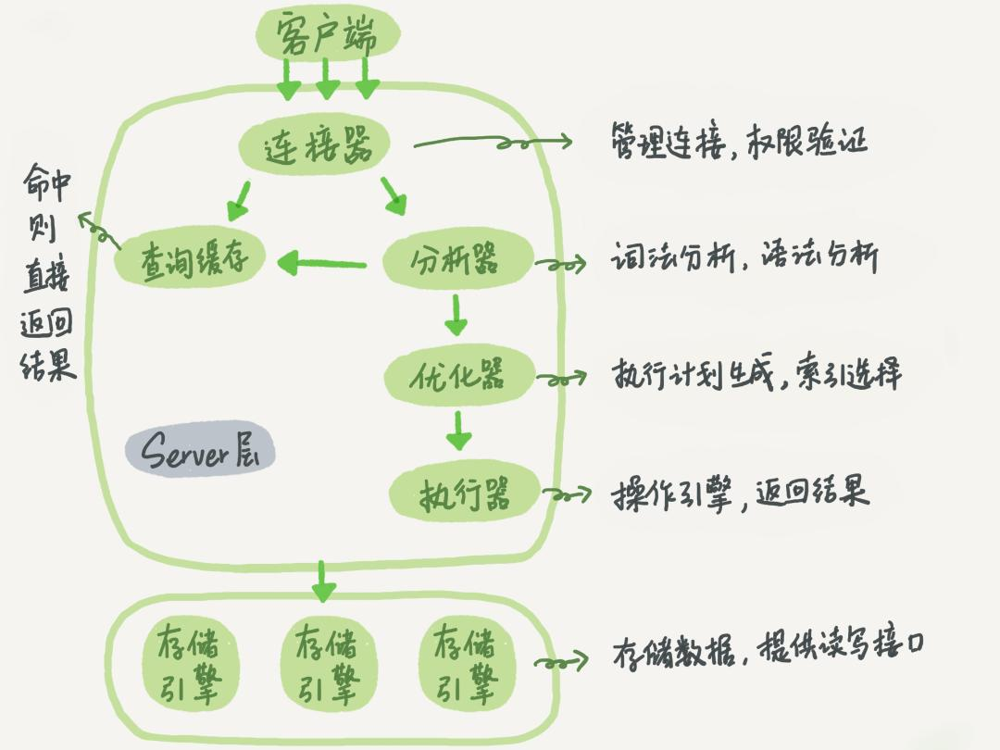

学习一下mysql还是很有必要的(•̀⌄•́)
　　　　　　　　　　　　　　　　　　　　　　　　　　　　　　——　by JiHan
* * *
*以下内容都是根据书中的章节目录，并且根据自己的缺陷进行记录的。*

<!-- more -->

### 第一章  mysql架构和历史
**架构逻辑**：
mysql将查询处理及其他系统任务和数据存储/提取进行分离

*[图片来源](https://www.yinxiang.com/everhub/note/39051186-8641-4d49-852b-256cf80d3a22)*
存储引擎部分，仅仅是响应上层服务器请求，相互之间不会进行通信。
服务器会验证客户端密码或者证书，并且在认证通过后查询该客户端的权限。
**并发控制**：
读写锁作为实现原理，锁的粒度作为性能的考量(锁的开销和安全性的平衡)，mysql提供了表锁和行级锁
**事务**：
mysql中的一个原子性sql查询，或者独立工作单元
原子性，一致性，隔离性，持久性。
隔离级别：未提交读，提交读，可重复读，可串行读。
死锁：检测，死锁的循环依赖。解决，最少行级排他锁回滚。
事务日志：先将数据进行内存拷贝，再将需要进行的I/O读写操作写入到日志，由后台根据日志进行数据写入。如果数据本身还未写入磁盘，系统崩溃，相应的存储引擎也有相应的数据恢复策略。(怎么搞的？？)
mysql中默认自动提交，将每一次查询都当做一个事务提交。
事务是由存储引擎实现，如果使用多种存储引擎(事务型和非事务型)，会变得不可靠。

**多版本并发控制(mvcc)**：
