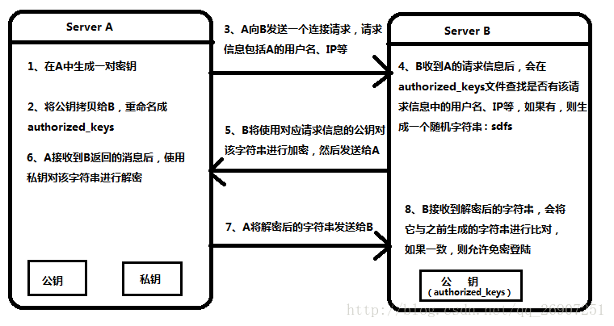
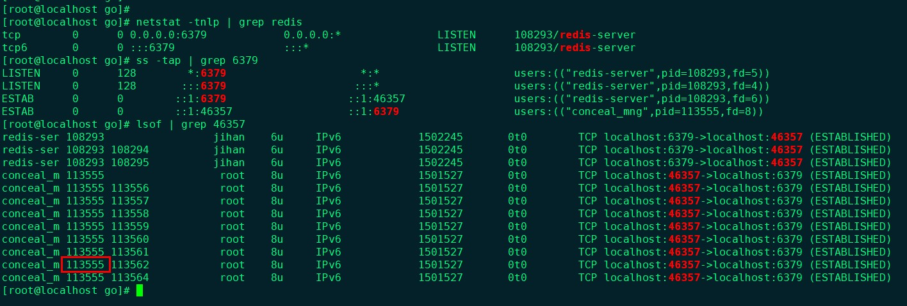

谁知道这里面有多少小技巧，没准哪个能帮上你呢？(•̀⌄•́)
　　　　　　　　　　　　　　　　　　　　　　　　　　　　　　——　by JiHan
* * *

<!-- more -->


### ssh免密登录
**原理：**

**实际配置：**  
1. 生成秘钥对：
   本地主机：
      ```sh
      ssh-keygen -t rsa
      ```
2. 拷贝公钥到远程主机：
   1. 简单方法，在本地主机执行：
      ```
      ssh-copy-id remote_username@server_ip_address -p port
      ```
      *不加`-p`默认22端口*
      然后输入密码即可
   2. 先登录远程主机：
      1. 获取本地主机的公钥，追加到`authorized_keys`：
         ```sh
         cat id_rsa.pub >> authorized_keys
         ```
      2. 修改权限：
         ```sh
         chmod 600 authorized_keys
         ```
      3. 重启服务(不一定需要)：
         ```sh
         service sshd restart
         ```
3. 配置ssh名称(可选)
   为了方便记住输入远程主机设备，可给远程主机配置名称。
   ```
   # vi ~/.ssh/config
   Host remote
   User root
   Hostname 192.168.0.1
   Port 22
   # ssh remote
   ```

**测试：**  
本地主机登录远程主机：
```sh
ssh remote@<ip>
exit
ssh #免密
```

**配置ssh禁用密码登录：**
增加安全性，避免别人尝试非法登录。
1. 完成上述的免密登录，服务端获得一个公钥，本机获得一个私钥
2. 将私钥保存，供其他设备使用
3. 设置服务端配置文件`/etc/ssh/sshd_config`，关闭密码登录：
   ```
   #禁用密码验证
   PasswordAuthentication no
   #启用密钥验证，下面两个默认都是开启的
   RSAAuthentication yes
   PubkeyAuthentication yes
   ```
4. 重启sshd服务：
   ```
   systemctl restart sshd
   ```

### VSCODE
插件列表：  
1. Remote-SSH：远程ssh登录，linux版本太低不支持
2. sftp：远程文件同步
3. vscode-icons：文件图标显示
4. markdown all in one：Markdown插件
5. markdown preview  Enhanced：Markdown预览
    cmd：Markdown Preview Enhanced: Customize Css
    background-color: rgb(157, 189, 189);
    font-family: -apple-system, BlinkMacSystemFont, "Segoe UI", Helvetica, Arial, sans-serif, "Apple Color Emoji", "Segoe UI Emoji", "Segoe UI Symbol", "微软雅黑";
6. tabNine：机器学习补全(可能导致和语言补全冲突)
7. go 补全插件，建议使用gopl，之前补全太慢，[解决](https://blog.csdn.net/zhetmdoubeizhanyong/article/details/102534172)
8. koroFileHeader：用于生成标准格式函数头说明，或者代码文件头说明
9. bookmarks：给代码打标签
10. Draw.io integration：drawio的绘图插件


### C 段错误处理(Linux)
1. 必须先得到段错误的地址，可以用gdb的bt或者在程序中捕捉段错误堆栈。`SIGSEGV, SIGABRT`
2. 在可以编译的机器上源码编译，带上行号和函数名，使用`addr2line -f -e <file> <addr>`来映射到具体的函数位置。
3. `objdump -D <file> | grep -A 50 -B 50 <addr>` 也能查到对应汇编代码，从而定位函数。

### 进程运行状态查看
`pstack <pid> `查看当前运行程序的运行状态，非常方便排查阻塞和死锁问题。
`ps aux --sort -rss` 按照内存占用排序，排查进程内存泄漏。
`ps v <pid>`查看某个进程具体的信息，类似top列出的进程信息。

###   断言assert
处理程序中不应该发生的错误，常用在参数检查。
[参考1](http://c.biancheng.net/c/assert/), [参考2](https://www.runoob.com/w3cnote/c-assert.html)
### ipset源码技巧
ipset源码分析
1. 这里有个很牛皮的操作，在c里面实现的模块化加载。具体操作如下：
   如果我想在ipset中支持一种新的添加规则，比如hash:ip，那么，我需要改多少源码？
   ```
   1. 按照格式写好ipset_hash_ip.c里面包含了hash:ip的传输规则和初始化方法。
   2. 重新执行configure，加入这个规则（这里具体实现我没有确认，但猜测如此）
   3. 执行make
   ```
   那么其具体实现方法如何？
   ```
     1. 首先在configure中会根据你配置的支持规则模块生成makefile，makefile中就会包含编译这个模块的源文件。
     2. make时会根据配置产生的源文件列表，生成一个type_init.c文件，里面包含了所有规则模块的初始化。
     3. 主函数会调用type_init.c源文件，将初始化好的规则加载到一个全局链表中，在规则匹配的时候进行匹配。
   ```
   这种方法就实现了模块化的添加和删除规则模块的方法。这种模块化的思想，在其他语言里并不少见，但是在c语言里面实现的，还是少见(菜鸡的我反正第一次见)
2. 提供了接口，自定义输出函数和日志输出文件。
3. X Macros宏使用，类似定义一个map，但是比map功能更丰富。
   ``` c
   #include <stdio.h> 

   // Defines four variables. 
   #define VARIABLES \ 
      X(value1, 1) \ 
      X(value2, 2) \ 
      X(value3, 3) \ 
      X(value4, 4) 

   // driver program. 
   int main(void) 
   { 
      // Declaration of every variable 
      // is done through macro. 
      #define X(value, a) char value[10]; 
         VARIABLES 
      #undef X 
      
      // String values are accepted 
      // for all variables. 
      #define X(value, a) scanf("\n%s", value); 
         VARIABLES 
      #undef X 
      
      // Values are printed. 
      #define X(value, a) printf("%d) %s\n", a, value); 
         VARIABLES 
      #undef X 
      return 0; 
   } 
   ```
   实际上预编译后的代码：
   ``` c
   #include <stdio.h> 

   int main(void) 
   { 
      char value1[10]; 
      char value2[10]; 
      char value3[10]; 
      char value4[10]; 

      scanf("\n%s", value1); 
      scanf("\n%s", value2); 
      scanf("\n%s", value3); 
      scanf("\n%s", value4); 

      printf("%d) %s\n", 1, value1); 
      printf("%d) %s\n", 2, value2); 
      printf("%d) %s\n", 3, value3); 
      printf("%d) %s\n", 4, value4); 
      return 0; 
   } 
   ```
   示例2：
   ```c
   #include <stdio.h> 

   // Defining a macro 
   // with the values of colors. 
   #define COLORS \ 
      X(RED)	 \ 
      X(BLACK) \ 
      X(WHITE) \ 
      X(BLUE) 

   // Creating an enum of colors 
   // by macro expansion. 
   enum colors { 
      #define X(value) value, 
         COLORS 
      #undef X 
   }; 

   // A utility that takes the enum value 
   // and returns corresponding string value 
   char* toString(enum colors value) 
   { 
      switch (value) { 
         #define X(color) \ 
            case color: \ 
               return #color; 
               COLORS 
         #undef X 
      } 
   } 

   // driver program. 
   int main(void) 
   { 
      enum colors color = WHITE; 
      printf("%s", toString(color)); 
      return 0; 
   } 
   ```

   实际上预编译后的代码：
   ```c
   #include <stdio.h> 

   // Creating an enum of colors. 
   enum colors { 
      RED, 
      BLACK, 
      WHITE, 
      BLUE 
   }; 

   /*A utility that takes the enum value and returns 
   corresponding string value*/
   char* toString(enum colors value) 
   { 
      switch (value) { 
      case RED: 
         return "RED"; 
      case BLACK: 
         return "BLACK"; 
      case WHITE: 
         return "WHITE"; 
      case BLUE: 
         return "BLUE"; 
      } 
   } 

   // driver program. 
   int main(void) 
   { 
      enum colors color = WHITE; 
      printf("%s", toString(color)); 
      return 0; 
   } 

   ```
   X macros 主要适用于多中类型有相同的处理逻辑。简单的类似enum中int到string的映射，复杂的到ipset的多种类型处理。
4. gcc 编译debug模式或者自定义模式。`-Dxxx`。示例：
   test.c:
   ```
   #include <stdio.h>

   int main(int agv, char *agrs[]){
   #ifdef TEST
      printf("ENABLE TEST\n");
   #endif
      printf("test over\n");
      return 0;
   }
   ```
   执行TEST：
   ```
   $ gcc test.c -DTEST -o test
   $ ./test
   ENABLE TEST
   test over
   $ gcc test.c -o test
   $ ./test
   test over
   ```
   这种方式在做C的模块编译，以及Debug编译特别有效。DEBUG适合开源代码，不适合现场代码排查。
   [15个最常用的GCC编译器参数](https://colobu.com/2018/08/28/15-Most-Frequently-Used-GCC-Compiler-Command-Line-Options/#%E4%BD%BF%E7%94%A8-V%E6%89%93%E5%8D%B0%E6%89%80%E6%9C%89%E7%9A%84%E6%89%A7%E8%A1%8C%E5%91%BD%E4%BB%A4)
5. 源码编译的时候，缺少依赖库。
   * 一般的解决方法，都是直接用yum install libxxx-devel.x86_64，再次进行configure。
   * 如果还不成功，就检查你的`PKG_CONFIG_PATH`变量是否存在，不存在添加对应的环境变量(默认一般在`/usr/lib64/pkgconfig/`)。
   * 如果还不行，就执行`/usr/bin/pkg-config --exists --print-errors "libxxx >= x.x.xx"`(通常这个命令可以在configure文件中找到)，然后再根据问题来排查。
   * 最后的方法，就是用`./configure --help`来找到对应的库的环境变量名称，修改对应的`libxxx_LIBS`

### 一些工具
[查找各种代码的使用范例](https://golang.hotexamples.com/)

### go好用的开源组件
配置文件读写：
* github.com/spf13/viper

日志：
* go.uber.org/zap

web服务：
* github.com/gin-gonic/gin

go编写命令：
* github.com/urfave/cli/v2

restful 文档生成：
* https://github.com/swaggo/gin-swagger 
  * [全教程](https://awesomeopensource.com/project/swaggo/swag)
  * [教程](https://zhuanlan.zhihu.com/p/40304004)
  * [教程](https://juejin.im/post/5d3f92356fb9a06b317b3baf)


### Go技巧
1. 测试
   1. 单元测试
      就是常用的以`_test.go`结尾的文件，函数名`Testxx`来构成的单元测试。如果你想将单元测试编译出来，可以使用`-c`参数，执行测试程序的时候，使用`-test.xxx`来执行test相关命令。例如：`go test -run xxx`=`./a -test.run xxx`
   2. 性能测试
      同样在`_test.go`结尾的文件中，以`Benchmark`为开头的性能测试，具体用法可以[参考](https://my.oschina.net/solate/blog/3034188), 生成性能图和火焰图更有利于分析。[另外的参考](https://zhuanlan.zhihu.com/p/80578541)

### xrags
常见的用法：
1. `ls | xargs echo` 相当于`echo a b c`
2.  `ls | xargs -i echo {}` 相当于 `echo a; echo b; echo c`，`-i`同`-I '{}'`，其含义是将`{}`内的内容替换成前面输出的内容，并且循环执行。
3.  `-t`参数可以查看你xargs执行的命令。

**注意：** 如果在xargs后的命令参数中，路径参数有空格的或tab的，会导致路径无法识别。比如`echo "/home/jihan " | xargs -i ls {}`就会报错，虽然实际命令`ls /home/jihan<空格>`没有问题，但是用xargs+i的形式就有问题。

### shell调试
1. -n 命令，显示shell，不执行，通常用于语法检查。
2. -x 命令，我经常用，在执行过程中打印shell脚本执行的真实命令。-v是打印原始命令，不做替换。
3. bashdb，类似gdb做调试用，命令：`bashdb --debug your.sh`，一下是常用参数：
   ```
   一、列出代码和查询代码类：
   l  列出当前行以下的10行
   -  列出正在执行的代码行的前面10行
   .  回到正在执行的代码行
   /pat/ 向后搜索pat
   ？pat？向前搜索pat
   二、Debug控制类：
   h     帮助
   help  命令 得到命令的具体信息
   q     退出bashdb
   x     算数表达式 计算算数表达式的值，并显示出来
   !!    空格Shell命令 参数 执行shell命令
   使用bashdb进行debug的常用命令(cont.)
   三、控制脚本执行类：
   n   执行下一条语句，遇到函数，不进入函数里面执行，将函数当作黑盒
   s n 单步执行n次，遇到函数进入函数里面
   b   行号n 在行号n处设置断点
   del 行号n 撤销行号n处的断点
   c   行号n 一直执行到行号n处
   R   重新启动当前调试脚本
   Finish 执行到程序最后
   cond n expr 条件断点
   ```

### 查找与当前进程通信的所有进程
1. 找到当前进程S的进程pid
2. 获取与S通信A的tcp端口号
3. 通过A的tcp端口号，获得A的进程pid


### 程序执行时的系统调用
`strace` 是 Linux 中用于监控和篡改进程与内核之间操作的工具。非常强大的工具，能够有效排查程序性能问题，异常操作以及段错误问题。

### 程序内存检测
`valgrind` [参考](https://www.jianshu.com/p/29a7a7d3d5b1)

### Linux文件锁定
在root权限下，有可能对某个文件都没有操作权限，可能是使用`chattr`对其进行锁定，可使用其进行解除。`lsattr`查看相应属性。[参考](http://c.biancheng.net/view/874.html)

### Linux 内核小版本升级
小版本，就是 `3.10.0-862`中`-`后的东西。而我们进行升级的时候，需要(centos为例，3.10.0-693升级到3.10.0-862)：
1. 大版本相同的一个设备(3.10.0-693)
2. 想要升级的rpm包(3.10.0-862)[官方](https://www.kernel.org/)，找不到直接Google搜吧。[这个网站很全](https://linuxsoft.cern.ch/cern/centos/7/updates/x86_64/repoview/kernel.html)
3. `yum install kernel-3.10.0-862.9.1.el7.x86_64.rpm`
4. grub2看看启动顺序`grub2-editenv list`以及`awk -F \' '$1=="menuentry " {print i++ " : " $2}' /etc/grub2.cfg`
5. reboot
6. ~~需要源码的情况下，执行`yum install kernel-devel`会自动根据内核版本下载安装源码到`/usr/src/kernels`中(会下载最新版本的，郁闷)~~
7. 需要内核源码的话，从网上搜索对应的源码，执行`yum install kernel-devel-xxxx.rpm`安装即可。[这个网站很全](https://linuxsoft.cern.ch/cern/centos/7/updates/x86_64/repoview/kernel-devel.html)

### linux源码编译

### 内核模块源码编译安装
用户态的源码编译安装，和普通的其他软件没有什么区别，基本都是make，make install，但是你要进行内核模块的源码构建，那么有如下几种方式:
1. 放在源码树以内(例如iptables)。假如我要自定义一个netfilter的模块，而且希望将他存放于/net/netfilter/目录下，那么要注意，在该目录下存在大量的.c源码文件。如果你的模块文件仅仅只有一两个源文件，你可以直接将其放在该目录下，如果你的模块包含的源文件比较多的话，也许你应该建立一个单独的文件夹，用于专门维护你的模块程序源文件。假如创建一个目录名为：mynetfilter/子目录。接下来需要修改/net/netfilter/目录下的Makefile文件：
   ```
   Obj-m += mynetfilter/
   ```
   这行编译指令告诉模块构建系统，在编译模块时需要进入mynetfilter/子目录。如果你的模块程序依赖于一个特殊的配置选项。比如，CONFIG_ MYNETFILTER_TEST（该选项在编译内核时，执行make menuconfig命令时用于配置该模块的编译选项），你需要修改/net/netfilter/目录下的Kconfig文件
   ```
   config “MYNETFILTER_TEST”
   tristate “netfilter test module”
   ```
   编译内核时，执行make menucofnig之后，我们会在配置菜单上看到此选项,随之，需要修改Makefile文件，用下面的指令替换之前的`Obj-m += mynetfilter/`：
   ```
   Obj-$(CONFIG_MYNETFILTER_TEST)  += mynetfilter/
   ```
   最后，在/net/netfilter/mynetfilter/目录下添加一个Makefile文件，其中需要添加下面的指令：
   ```
   Obj –m  += mynetfilter.o
   ```
   准备就绪了，现在构建系统会进入到mynetfilter/目录下，将mynetfilter.c编译为mynetfilter.ko模块。
   附：如果你只想编译内核中某个模块的ko，也可以cd到该目录，执行：
   ```
   make CONFIG_XXX=m –c  /kernel/source/location SUBDIRS=$PWD modules
   ```
2. 内核源码树之外构建(例如ipset)
   如果将模块代码放在内核源码树之外单独构建的话，你只需要在你的模块目录下创建一个Makefile文件，添加一行指令：
   ```
   Obj-m := mynetfilter.o
   ```
   如果你有多个源文件只需添加另一行指令：
   ```
   mynetfilter-objs := mynetfiler-init.o mynetfiler-exit.o
   ```
   模块在内核内和内核外构建的最大的区别在于构建过程。当模块在内核源代码树之外构建时，你必须告诉make如何找到内核源代码文件和基础Makefile文件。通过下面的指令完成上述功能：
   ```
   make –c  /kernel/source/location SUBDIRS=$PWD modules
   ```
   其中，/kernel/source/location/ 即为你配置的内核源代码树的位置。SUBDIRS是你需要编译的模块位置。

### Linux 内核模块加载
[版本检查机制](https://www.ibm.com/developerworks/cn/linux/l-cn-kernelmodules/?ca=drs)

### Linux路由操作
路由：某个ip(某个范围ip)应当到哪个网关去找。网关对应下一条路由。
**添加默认路由：**
`route add default via 192.168.161.11 dev eth0`
**添加一般路由：**
`route add -net 192.168.62.11 netmask 255.255.255.0 gw 192.168.1.1`
或
`route add -net 192.168.62.0/24 gw 192.168.1.1`
**删除路由：**
`route del -net 192.168.62.11 netmask 255.255.255.0`
或
`route del -net 192.168.62.0/24`

- `net` 表示一个ip或者网段
- `gw` 表示网关或下一跳路由
- `dev` 表示对应的出口网卡

### mysql 性能优化
[TinkPHP 对mysql 20条优化建议](http://blog.chinaunix.net/uid-26870656-id-4287492.html)

### sudo、su和sudo -s的差别


###  relocation error: /usr/lib64/libc.so.6: symbol _dl_starting_up, 
relocation error: /usr/lib64/libc.so.6: symbol _dl_starting_up, version GLIBC_PRIVATE not defined in file ld-linux-x86-64.so.2 with link time reference 问题解决
在建立一个错误的软连接到ld-linux-x86-64.so.2时，悲剧就这么发生了。此时大部分命令都不能使用，SSH当然也不能登录了。这个时候一定不要退出终端。

有人说那就把软连接复原吧，可是ln也同样无法使用。。。这时候我们就可以使用可爱的sln命令就可以了，哈哈。

lsn /usr/lib64/ld-2.17.so /usr/lib64/ld-linux-x86-64.so.2 

### linux死亡操作
随意动`/usr/lib64`或`/lib64`下的库，特别是`ld、libc`之类的，**覆盖、移动和删除**效果都差不多，基本就是系统爆破级别的。特别注意升级openssl，gcc都容易出现这种问题。附上linux文件目录结构（[参考](https://www.runoob.com/linux/linux-system-contents.html)）：


### Gcc静/动态链接库链接顺序
**静态库**链接时搜索路径顺序：
1. ld会去找GCC命令中的参数-L
2. 再找gcc的环境变量LIBRARY_PATH
3. 再找内定目录 /lib /usr/lib /usr/local/lib 这是当初compile gcc时写在程序内的

**动态库**链接时、执行时搜索路径顺序:
1. 编译目标代码时指定的动态库搜索路径
2. 环境变量LD_LIBRARY_PATH指定的动态库搜索路径
3. 配置文件/etc/ld.so.conf中指定的动态库搜索路径
4. 默认的动态库搜索路径/lib
5. 默认的动态库搜索路径/usr/lib

链接时相互依赖顺序是从右到左，越是底层，越靠后写。例如：
```
g++ ...  obj($?) -l(上层逻辑lib) -l(中间封装lib) -l(基础lib) -l(系统lib)  -o $@
```

有关环境变量：
LIBRARY_PATH环境变量：指定程序静态链接库文件搜索路径
LD_LIBRARY_PATH环境变量：指定程序动态链接库文件搜索路径

对于排查链接问题方法：
`ldd <your_lib>`：查看可执行程序或者动态库运行时的链接库
`readelf -d <your_lib>`：和ldd类似，不用运行程序，查看可执行程序或动态库[ELF](https://en.wikipedia.org/wiki/Executable_and_Linkable_Format)
`LD_DEBUG=libs ./<your_exe>`：查看程序执行时的动态库调度过程。
`ldconfig`：它会遍历默认所有共享库目录，比如/lib，/usr/lib等，然后更新所有的软链接，使她们指向最新共享库。

指定动态库版本或路径：
`-Wl,-rpath,<your_lib_path>`: 指定程序运行时动态库链接路径。
将`-lxxx`直接修改为`/you/path/libxxx`，可以指定动态库的绝对路径。


参考：
[wiki rpath](https://en.wikipedia.org/wiki/Rpath)
[rpath vs runpath](https://medium.com/nataraj-raghavendra/rpath-vs-runpath-883029b17c45) 附加了许多动态库加载的示例。
[静态链接与动态链接库的查找顺序](https://www.cnblogs.com/GnibChen/p/8649476.html)
[gcc 链接库的顺序问题](https://blog.csdn.net/ssmale/article/details/17225345)
[gcc/ld: what is to -Wl,-rpath in dynamic linking what -l is to -L in static linking?](https://stackoverflow.com/questions/33373851/gcc-ld-what-is-to-wl-rpath-in-dynamic-linking-what-l-is-to-l-in-static-link/33378137)
[Why LD_LIBRARY_PATH is BAD and the correct way to load dynamic libraries](https://stackoverflow.com/questions/25918462/why-ld-library-path-is-bad-and-the-correct-way-to-load-dynamic-libraries)

### 有关linux下的目录
[上述](#linux死亡操作)有相关的linux目录结构，这里说明一下`/tmp`目录，在linux系统中，`/tmp`目录在一定周期或者重启等都有可能删除相应部分符合条件的文件。而删除方法是通过执行定时任务`/etc/cron.daily/tmpwatch`，此定时任务在系统最小安装的情况下，需要手动安装。

### 关于系统监控
相对大型系统，都需要进行系统监控。特别针对于微服务系统架构。个人理解需要从三个方面进行监控(另[可参考](https://zhuanlan.zhihu.com/p/83654617))：
1. 业务逻辑层，负责统计业务访问状态，访问结果，异常等(常用方式log输出。比如syslog)——通常管理员用户都关注
2. 分布式链路追踪，又称为APM。用于追踪一个业务从开始到结束中间每个阶段的执行情况，用于多组件排错非常方便。(opentracing, Zipkin and Jaeger)——通常管理员关注
3. 系统整体运行状态，关注系统整体内存，网络，cpu等使用情况。（Prometheus）——管理员关注

### 关于软件项目方案评估
1. 易用性 
2. 可用性
3. 性能
4. 安全性
5. 可维护性(日志，监控系统)
6. 可扩展性